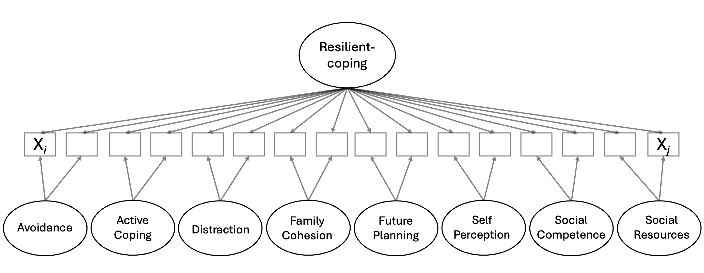
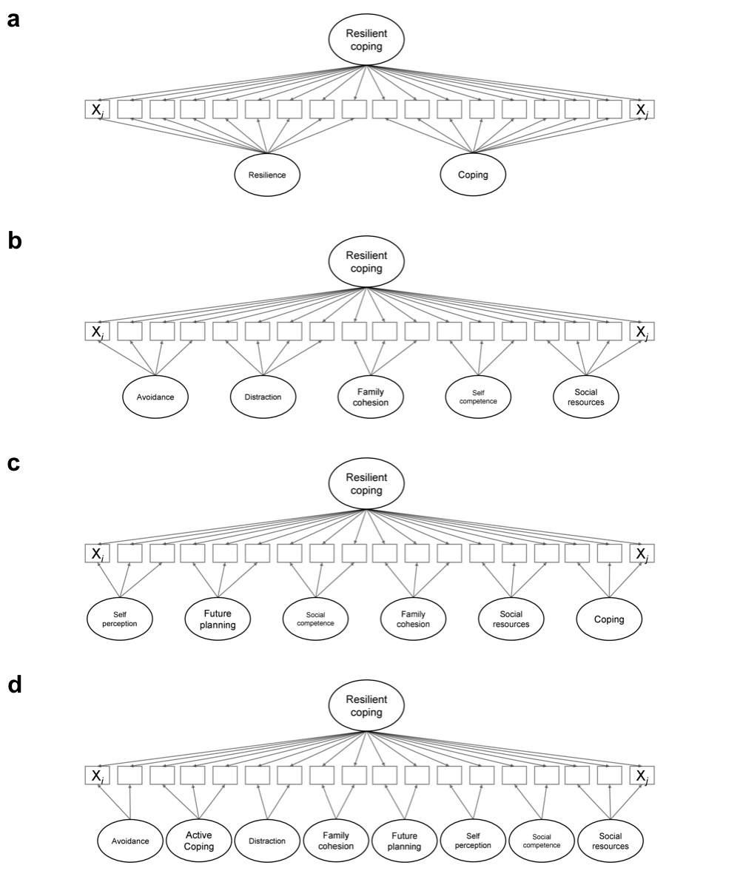

\pagenumbering{arabic}

```{r setup, include = FALSE}
#setwd("/Users/cselva1/Desktop/BF_export/Analysis/paper") 
#setwd(dirname(rstudioapi::getActiveDocumentContext()$path))

library("papaja")
#r_refs("r-references.bib")

# This is needed to include captions above. 
source("figcap-above.R")
knitr::knit_hooks$set(plot = figcapabove_hook_plot_tex)

```

```{r analysis-preferences}
# Seed for random number generation
set.seed(42)
knitr::opts_chunk$set(cache.extra = knitr::rand_seed)
```

# Introduction
\justifying
|       The concepts of resilience and coping offer profound insights into human adaptability and strength. @southwick2018resilience provide a compelling narrative that illustrates this: many individuals, when faced with traumatic experiences, not only endure but adapt in ways that allow them to lead purposeful lives again. This adaptation varies significantly among individuals. Some may momentarily experience distress but eventually return to a state as if the trauma had never occurred. Others may continue to feel the impact, yet they discover healthy coping mechanisms, often emerging more robust and more insightful. In current research, *resilience* is often defined as the process of positive adaptation in the face of adversity [@luthar_resilience_2006; @southwick2014resilience], while *coping* includes cognitive and behavioral strategies beneficial to individuals in managing both internal and external stressors [@folkman2004]. 

|       However, there is a debate regarding whether resilience and coping are two different constructs and thus be evaluated as distinctive from one another or as intertwined constructs that can be assessed within one framework. For example, @fletcher_sarkar2013 argue for a strict distinction of both concepts. On the contrary, other scholars like @southwick2018resilience propose a more unifying approach, using the terms *coping mechanisms* and *resilience factors* interchangeably, thereby suggesting a view of closely related concepts. In a related manner, Leipol and Greve [-@leipold_greve_2009] argue that there are conceptual differences between coping and resilience; However, they suggest these differences are "mainly a matter of conceptual hierarchy, rather than an empirical issue", proposing that resilience is a broader concept that encompasses coping as one of its components (\textcolor{blue}{p. 41}). With these perspectives in mind, researchers interested in resilience and coping under a combined framework in practice utilize two distinct instruments to measure the two constructs separately. However, this comes with limitations, as different measures are often not strictly comparable for example because of different conceptual assumptions, test lengths, and item difficulties [@buhner2006einfuhrung].

|       An empirical attempt to move away from a distinctive perspective and more towards a combined approach has been contributed by @sinclair_development_2004. Their 4-item short scale emphasizes the underlying core ability, and despite its lack of utilization in standard practice, it marks a noteworthy development. However, it can be argued that the measure does not adequately reflect a multidimensional perspective of resilience and coping. Currently, no measurement captures resilience and coping (besides its general factor) as a multifaceted phenomenon. 

|       In our research, we address the assumption of multidimensionality for resilient-coping (hereinafter referred to as an umbrella term) by analyzing frequently used resilience and coping models for which we extract factors and compose corresponding items. We employ multiple methods, including classical test theory (CTT) for factor-level analysis and item-response theory (IRT) for item-level analysis and model comparison. Specifically, our study tests two established models [resilience, @kaiser2019; coping, @ayersetal_1996], along with a new combined version of these two models, each fitted with an additional general factor (i.e., bifactor) to our data. The selected model serves as the basis for constructing a measurement tool for the construct of interest. This research contributes to the field by offering a comprehensive factorial structure that bridges theoretical assumptions with empirical findings. Furthermore, by providing an open-access German measurement for resilient-coping, our work not only expands research possibilities but also offers practitioners a valuable instrument for assessing this construct with multiple factors with equal representation of resilience and coping components.

## Measuring resilience: towards a resilient-coping perspective

|       From a psychometric perspective, several resilience frameworks with varying dimensional assumptions and focus are worth mentioning which contribute to a better understanding of the resilient-coping construct.

|       The first scale where resilience was empirically measured was developed by Wagnild and Young [-@wagnild_development_1993], and while initially conceptualized as two-dimensional (personal competence and acceptance of self and life), it was predominantly utilized in a one-dimensional manner [@schumacher2005resilienzskala]. This early approach to measuring resilience hinted at the complexity of the construct but did not fully capture its multifaceted nature. An example of a multidimensional conceptualization of resilience is the model of @southwick2018resilience. They describe resilience as a complex and dynamic phenomenon associated with the ability to withstand adversity. This does not imply immunity to adversity but rather the capacity to continue with the essential aspects of one's life despite painful and distressing symptoms. They grounded their research in psychological and neurobiological studies and carried out interviews with a large number of highly resilient individuals, including former Vietnam prisoners of war, Special Forces instructors, and civilians who had survived and thrived despite significant stress and trauma. From these interviews, ten resilience factors were identified and described: *optimism*, *facing fear*, *moral compass*, *religion and spirituality*, *social support*, *role models*, *training*, *brain fitness*, *cognitive and emotional flexibility*, and *meaning, purpose, and growth*. However, when it comes to measuring, only a few instruments offer such multidimensional perspective. One example is, Friborg's resilience scale for adults [RSA, -@friborg2003], emphasizing personal protective factors and familial and extra-familial social support. The RSA [based on the five-factor model by Hjemdal et al., -@hjemdal_mestring_2001] assumes a six-factor structure, and so does the German adaptation by @kaiser2019. Included factors are *perception of self*, *planned future*, *social competence*, *structural style*, *family cohesion*, and *social resources*. 

|       While respective models have identified factors associated with resilience, they seem to overlook an arguably aspect: the role of coping. For instance @vanderhallen2020 conducted cross-sectional network analysis, which demonstrate strong, positive associations between coping and resilience factors. The study found that coping and resilience are distinct yet related constructs, with social support, active coping, goal efficacy, and planning being important in bridging the gap between the two. In addition, the relationship between resilience, positivity, and coping strategies has been explored by @fuente, and a significant differential association between resilience factors and coping strategies has been found. This indicates that resilience and coping are, to some extent, inseparable. Aligning with such perspective, some models incorporate coping within their conceptualization of resilience, acknowledging the potentially intertwined nature of these constructs.

|       The generic model by @agaibi_wilson_2005 is here of particular interest, as it describes resilience as a response to psychological trauma with key variables such as personality characteristics, affect regulation, ego-defence, coping, and the use and mobilization of protective factors and resources to support coping. These variables dynamically interact in determining resilient behavior triggered by traumatic life experiences. Optimal coping and adaptation are defined as highly resilient behaviors in terms of acute and long-term positive adaptation, while minimal coping defines acute and long-term negative adaptation and represents a significant risk factor for the development of psychopathologies such as post-traumatic stress [@agaibi_wilson_2005]. @leipold_greve_2009 propose a conceptually similar relationship between coping and resilience in their integrative model of coping, resilience, and development. They argue that individual stability under significant adverse conditions results mainly from coping processes influenced by personal and situational conditions. They also suggest that resilience, viewed as a stabilizing constellation, should be considered an essential part of the conceptual bridge between coping and development. 

|       Even though the relationship between resilience and coping remains unclear at a broad level, the previous two models demonstrate that integrating coping into the resilience framework is both possible and promising.

## Learnings from coping models

|       Over the years, various coping models have been developed, each highlighting different aspects of coping processes and strategies (see @kato2015 for a meta-analysis on frequently used coping scales). The initial model of coping created by @lazarus1984stress categorizes coping strategies into two primary types: problem-focused and emotion-focused coping. Problem-focused coping involves actions directed at managing or altering the problem causing the stress, whereas emotion-focused coping involves managing the emotional response to the problem. This distinction has been influential in subsequent research and has helped understand how coping mechanisms can vary depending on the context and the individual's perception of control over the stressor [@folkman_personal_1984; @moos2003]. Despite the utility of these models, there are limitations to consider. For instance, the Lazarus and Folkman's model fails to account for the variability in coping effectiveness. Empirical evidence suggests that the success of coping strategies can depend on several contextual factors, such as the specific nature of stressors, individual variations in personality, prior experiences, and social integration [e.g., @schwarzer_positive_2003; @skinner_searching_2003]. Additionally, some studies have pointed out that this model oversimplifies the complexity of coping processes by not adequately addressing the dynamic and reciprocal interactions between the individual and their environment, highlighting aspects of volitional and involuntary responses to specific domains of stress [@connor-smith_responses_2000].

|       Alternative models have been proposed to address the limitations of previous coping theories (e.g., @connor-smith_responses_2000; @compas_effortful_1997; @eschenbeck). One significant model, grounded in Lazarus and Folkman's work, is the Carver and Scheier model [COPE, 1981, 1990, cited in @carver_you_1997], which identified multiple coping factors and developed a corresponding measurement tool. The COPE inventory originally comprised 15 subscales, such as positive reframing, self-distraction, and venting. Over time, the questionnaire underwent adaptations and was shortened, including the addition of the "use of *humor*" subscale. These modifications led to the creation of the Brief COPE questionnaire. In its final version, which consists of 14 subscales [@carver_you_1997], three scales were revised, a new subscale, *substance use*, was added, and two scales were removed due to usability issues identified in previous studies. Despite these adaptations, the empirical structure of the COPE model remains partially unclear.

|       Subsequent studies suggested a separation of the COPE into different groups. For instance, @coolidge_personality_2000 used in their study a grouping of three types of coping: problem-focused coping, emotion-focused coping, and dysfunctional coping. In contrast, prior to Coolidge and colleagues, @ayersetal_1996 proposed a model that integrates five dimensions of coping into a hierarchical structure: *avoidance*, *cognitive reconstruction*, *distraction*, *problem-solving*, and *support-seeking*. In a study investigating different solutions for the COPE, including the ones mentioned above, the Ayers and colleagues' factor solutions for the COPE were reported to be superior [@doron_examination_2014]. While coping primarily centers on individuals' strategies for managing stressors, it can contribute to positive adaptation in the face of significant adversity (i.e., adversity in the context of resilience). However, relying solely on coping (or resilience alone) may not be comprehensive enough to address all factors that mitigate adversity.

# Aim of the current study

|       The previous two sections emphasized the importance of undestanding resilience and coping not as mere standalone concepts. When interested in all aspects that contribute to a positive adaptation of individuals in the face of adversity, a combined perspective becomes necessary (i.e., resilient-coping). The subsequent section outlines the current underpinnings of the initial resilient-coping measure and seeks to reintroduce the phenomenon under a different conceptualization and definition.

|       ***(Re)introducing resilient-coping.*** In the quest to measure resilient-coping, we draw inspiration from the BRCS that introduced an empirical basis for the construct of interest. Their foundation lays in Polk's work from nursing [-@polk_toward_1997] which can be used as goal setting in the chronic illness population toward achieving higher levels of resilience. In her model, Polk identified 26 attributes of resilience which she then categorized into four patterns: dispositional, relational, situational, and philosophical. More traits in each of the four categories, along with a greater total number of traits, lead to higher diversity and a stronger likelihood of resilience [@kenyon2020]. This model emphasizes that resilience encompasses more than mere recovery; it involves a dynamic interplay of factors that foster growth and adaptation in the face of adversity. Building from this model, the BRCS is designed for individuals exhibiting high resilience and provides a practical assessment tool. However, the resilient-coping concept is underutilized [due to a lack of content validity, @friborg], while recent contributions using the BRCS underscored the growing interest in this perspective and its potential for further exploration, specifically for the general population [@kocalevent_resilient_2017]. 

|       While the BRCS's empirical approach significantly contributes to the field, it is not an adequate tool for investigating the interplay of different resilience and coping factors. For such an investigation, a different conceptual perspective is needed that also addresses the recent shift in resilience research. Conceptually, resilience has long been viewed as a trait but is now increasingly recognized as a process initiated with perceived adversity (antecedent), which can result in positive adaptation (consequence) [@windle_2011]. Aligning with this processual perspective, where coping is viewed as a concept within the resilience process, Agaibi and Wilson’s model places individuals on a continuum of adaptation and resilience. This model considers both low vs. high resilience and minimal vs. optimal coping [@agaibi_wilson_2005, p. 211]. This perspective led us to reconceptualize coping as part of the resilience process, describable as resilient-coping.

|       With this thesis, we attempt to advance research on resilient-coping and provide a basis to test dimensional models and further understand how the general population navigate through adversity. Specifically, with this reintroduction of the concept, we hope to align more with the processual interplay of resilience and coping using a multidimensional approach. Our current working definition of resilient-coping is "*an individual's stability or quick recovery (or even growth) under significant adverse conditions. This phenomenon, in turn, needs to be explained by resilience attributes and coping mechanisms, which lead to certain developmental trajectories* [adapted and minorly adjusted from @greve_staudinger_2015, p. 41]." The following sections present the operationalization of the described phenomena.

|       ***Purpose.*** The purpose of the study is to bridge theoretical concepts with empirical findings, specifically focusing on resilience and coping attributes. Using multiple models of both resilience and coping, we identify factors contributing to the positive adaption of the general population and subsequentely summarize these findings under an empirical factor model. We attempt to create a measure that reflects three criteria: i) put sufficient emphasis on both resilience and coping components, and ii) reflect the construct of interest in a multidimensional manner. Along with the previous criterias, the main purpose is to develop and validate the RCQ, and therefore, we structure this thesis around three core objectives:

- **Development and dimensional assessment of the RCQ**: The initial objective is to construct the RCQ based on a comprehensive review of existing literature on resilience and coping mechanisms. We are utilizing a bifactor model, which is used to identify factors beyond a general component, as such general component is already captured by the BRCS. With the remaining source of variance, we explore different empirical structures and attempt to test and confirm a multidimensional structure for the resilient-coping construct.

- **Analysis of reliability for the RCQ**: Once an empirical structure is identified, a critical aim is to assess the reliability of the RCQ. This includes evaluating the internal consistency of the overall scale as well as its subscales, representing specific dimensions of resilient-coping. The reliability analysis is crucial for ensuring that the RCQ provides consistent and dependable measurements across different contexts and populations.

- **Validity statement for the RCQ**: The final objective is to establish the validity of the RCQ as a tool for measuring resilient-coping. This involves conducting a series of analyses to demonstrate the RCQ's convergent and discriminant validity, by correlating its scores with those of related and unrelated measures. The validation process is essential to ensure that the RCQ accurately measures the construct of resilient-coping and can be used confidently in psychological assessments and targeted interventions.

# Methods
## Participants

|       This study utilized a convenience sampling method to recruit participants from the general population, primarily through social media advertisements and local community boards. Additionally, data were collected through student projects at the University of Münster and the Hochschule Fresenius (i.e., Cologne and Düsseldorf). The eligibility criteria for participation included being 18 years or older and successfully passing awareness and thoroughness checks designed to ensure participant engagement and understanding of the study's requirements. After applying these criteria, the participant pool consisted of $N = 1171$ participants. The demographic breakdown of the sample was as follows: 76 percent female, 22 percent male, and 2 percent divers, with an age range from 18 to 89, and a mean age of $M = 28.11$ years ($SD = 11.39$). The majority of participants either possessed an academic degree or were in the process of pursuing such qualification, while 55 percent reported being students, 6 percent were employed part-time, 16 percent were employed full-time. A subsample of $n = 775$ participants provided additional information on their mental health. Among them, 40 percent reported having sought psychotherapeutic support, 29 percent reported considering seeking psychotherapeutic support, and 30 percent reported neither seeking nor considering psychotherapeutic support.

## Data collection and measures

|       Data for this study were collected from March 15, 2023, to May 8, 2024, through a self-administered, web-based survey using SosciSurvey. Participants were provided with detailed information about the study, including its purpose, procedures, potential risks, and benefits. Informed consent was obtained electronically before proceeding with the survey. Participants were compensated for their time and effort with a choice of a participant report detailing their assessment results, a monetary incentive through a raffle for three 20€ gift cards, and course credit, depending on their preference and eligibility. Data were anonymized and securely stored in accordance with ethical guidelines and data protection regulations. The items were scored on a 7-point agreement scale ranging from 1 ("*strongly disagree*") to 7 ("*strongly agree*"); some items were reversed. Additionally, demographic questions and validation measures, were included.

|       The additional measures selected for this study are based on their psychometric properties, reliability and validity, and relevance to the German-speaking population. Below, we detail the measures used, highlighting their development, internal consistency, and evidence of validity. Based on our validity strategy, we present them as three types: i) measures of the same underlying phenomena, ii) measures of related phenomena, and iii) measures of unrelated phenomena.  

|       ***Measures of same underlying phenomena*** 
`- German Version of the Resilience Scale (RS-11).` The eleven-item version of the resilience scale proposed by @schumacher2005resilienzskala, is designed to capture stress resistance as an unidimensional protective personality factor. The RS-11 demonstrates strong psychometric properties, with an internal consistency of $\upalpha$ = .91, indicating a high level of reliability. Furthermore, the scale's validity is supported through its correlations with measures of self-efficacy, providing adequate evidence for its effectiveness in capturing the construct of resilience.

`- Meaning-Centered Coping Scale (MCCS).` To assess coping mechanisms, we utilized the MCCS [@carreno]. The German version of this scale reports an internal consistency of $\upalpha$ = .81, suggesting a good level of reliability [@eisenbeck_international_2022]. The validity of the MCCS is assessed through its relationship with other relevant constructs, indicating strong evidence for its validity in measuring coping strategies that are centered around finding meaning in stressful situations.

`- Brief Resilient Coping Scale (BRCS).` We included the German translation of the Brief Resilient Coping Scale (BRCS), based on Sinclair and Wallston [-@sinclair_development_2004] and translated by Bathen-Gabriel [-@bathen2017resilience]. This scale is designed to assess individuals' tendencies to cope with stress in a resilient manner. The psychometric evaluation of the BRCS highlights its utility in measuring resilient coping, providing evidence of its reliability and validity. For the German version, @bathen2017resilience reported retest reliability of .62 and further reported good correlative evidence regarding the instrument validity aligning with attributes of the original version.

|       ***Measures of related phenomena (convergence)***
`- Satisfaction with Life Scale (SWLS).` The five-item SWLS was initially proposed by (Diener et al. 1985) and translated into German by [Schumacher, 2003, cited in @jankegloecknerrist]. The instrument captures subjective perceptions of life satisfaction. Factorial reliability analysis indicates sufficient formal validity. As indicators of the convergent validity, a positive correlation with social support and a negative correlation with depressiveness were shown [@glaesmer2011german].

`- General Self-Efficacy Scale (GSE).`The GSE, developed by Jerusalem and Schwarzer [@schwarzer], assesses the strength of an individual's belief in their ability to respond to challenging situations. The measure demonstrates high internal consistency, with Cronbach's alpha typically ranging from .82 to .93 [@schwarzer]. Multiple studies have demonstrated the construct validity of the General Self-Efficacy (GSE) scale across various domains, including well-being, health behaviors, coping strategies, stress appraisal, and social relationships, see Luszczynska et al. [-@Luszczynska_Gutierrez-Schwarzer_2005] and Luszczynska et al. [-@Luszczynska_Scholz-Schwarzer_2005].

`- Domains of the Big Five Inventory-2 (BFI-2).` The German BFI-2 [30-item, @rammstedt_etal] assess personality in five domains. The scale demonstrates psychometric properties, including high retest stability. The domains of the BFI are associated with important life outcomes, such as life satisfaction and intelligence. Furthermore, the facets of the BFI have incremental validity for predicting these outcomes, demonstrating their reliability and validity in assessing personality traits. We import two scales, extraversion ($\upalpha$ = .71) and negative emotionality ($\upalpha$ = .80), with regard to convergent validity.

|       ***Measures of unrelated phenomena (divergence)***
`- Further BFI-2 domains.` The remaining BFI scales, agreeableness ($\upalpha$ = .65), conscientiousness ($\upalpha$ = .75), and openness to experience ($\upalpha$ = .72) are imported under the assumption of unrelated phenomena.

`- Perceived Political Self-Efficacy (P-PSE).` The P-PSE [@bromme_translation_2020] measures individuals' beliefs in their ability to engage in political activities effectively. The implemented form (comprising ten items) demonstrates high internal consistency with McDonald's omega coefficient of .91. In a German sample the scale showed strong construct validity through its correlations with related constructs and criterion validity by predicting political participation propensity. The scale also maintained cross-cultural measurement invariance with an Italian sample, confirming its applicability across different cultural contexts. 
`- General Procrastination Scale (GPS-K).` The GPS-K [@gps] assesses individuals' tendencies to delay tasks or actions. It comprises nine items and is widely used in research and clinical settings. The scale exhibits strong reliability, with an internal consistency of $\upalpha = .86$. Additionally, the authors report significant correlations between procrastination scores and various measures of academic performance and psychological well-being, highlighting the scale's construct validity and predictive utility. The GPS-K also shows high convergent validity with other procrastination scales, evidenced by a very high correlation with the Procrastination Questionnaire for Students. Its discriminant validity is supported by non-significant or very low correlations with unrelated constructs like extraversion and openness to experience, confirming the scale's specificity in measuring procrastination. 

## General analytical approach

|       We were interested in essential attributes of resilient-coping and, therefore, reviewed empirical and theoretical models for both resilience and coping (some of them have already been mentioned in the literature review): COPE model, @carver_you_1997; Response to Stress model, @compas_effortful_1997, @connor-smith_responses_2000; resilience model, @southwick2018resilience; resilience scale for adults, @friborg2003, @kaiser2019; resilience in response to psychological trauma, @agaibi_wilson_2005. Using these models, we identified 26 factors associated with resilience and coping. We then defined each factor based on the model description and included further definitions and insights from relevant literature regarding each factor to allow a broader content domain. The definitions and descriptions were the basis for creating an initial item bank. In the pilot study, the item bank underwent exploratory testing (see [Appendix A](#appendixa)). Subsequently, based on the findings from the exploratory phase, a refined item pool was developed and is being retested in the current study. The two studies differ in their primary objectives. The exploratory nature of the pilot study aimed to avoid drawing any theoretical assumptions. Instead, the analysis was data-driven, with minimal guidance provided to allow the data to indicate directions for further exploration. In contrast, the present study revisits some of the previously introduced models to seek alignment between the identified structures and the outcomes of our exploratory analysis. Within each model, we assigned our items to factors by considering the initial factor assignment when composing the item (i.e., hereinafter referred to as an *theoretical factor*). In terms of sampling procedures, the pilot study analyzed the first 498 cases. For the current study, we included the remaining 673 cases, combining them with the pilot study data. While we acknowledge potential issues in combining the cases [@FokkemaGreiff], given that our aim is not to confirm exploratory directions from the pilot study, the increased degrees of freedom provided by the larger sample size outweigh these concerns. Additionally, IRT models generally perform better with more extensive data, enhancing the robustness of a dimensional analysis [@de2022theory].

|       ***Present study: dimensionality assessment.*** The primary aim of the present study was to determine a factorial structure of our resilient coping measure. We utilize a bifactor model to characterize our item bank to achieve this. This model was chosen for its ability to capture both a general factor and specific sub-dimensions within the overarching construct. Put differently, the bifactorial structure seeks to account for item covariation that is independent of the covariation attributed to the general factor [@gibbons_full-information_1992]. This is different to classical models, where items can be correlated because they are influenced by correlated traits [@reise_role_2007]. Therefore in our case, items can be correlated in our conceptualisation because they share a common trait (e.g., a given resilience or coping factor) and one additional source of common variation possibly due to shared item content (resilient-coping). Such bifactor models were successfully implemented in prior resilience and coping research [e.g. @nathaniel_etal_2022; @Rodrigues2022]. This study tests alternative factor models that have been reported in relevant research. Specifically, we test 4 models (plus two baseline models) with varying numbers of factors and varying item loading assumptions. Our primary base target is the eight-dimensional bifactor model (Model 5).

`- 1a. Baseline model resilience.` This model is an S-1 bifactor model where a global resilient-coping factor is modeled with an additional specific factor for items related to resilience. The items related to coping are used as a reference factor. In this model, variance is treated as attributable primarily to the global factor, with the specific factor accounting for the residual variance not explained by the global factor. This model indicates that the primary construct being measured is resilience, with the coping-related items providing additional, distinct information that is not captured by the global resilience factor. 

`- 1b. Baseline model coping.` Similarly, this model is an S-1 bifactor model with a global resilient-coping factor. However, the specific factor is coping, and the remaining resilience-related items are used as reference. 

`- 2. two-dimensional bifactor model (2D).` A model featuring a global resilient-coping factor alongside separate factors for resilience and coping. Every item was assigned to either the factor resilience or coping factor based on item content. 

`- 3. five-dimensional bifactor model (5D).` This model is defined in line with Ayer and colleagues' [-@ayersetal_1996] coping model. Specific factors include avoidance, cognitive reconstruction, problem-solving, distraction, and support-seeking. Items from our item bank were assigned to one of these factors and modeled alongside an additional general factor with constrained covariances. 

`- 4. six-dimensional bifactor model (6D).` Based on the resilience model identified by @kaiser2019, we assigned our item bank to factors of self-perception, future planning, social competence, family cohesion, and social resources. Unlike Model 3, we could not assign all items to the Kaiser and colleagues factor solution. Specifically, items that we associate with coping were not captured. Therefore, we added a coping factor, allowing us to include the remaining items into this model, making it a six-dimensional solution modeled alongside a general factor with constrained covariances. 

`- 5. eight-dimensional bifactor model (8D).` This model is developed based on the previous two assumptions of @ayersetal_1996 and @kaiser2019. We assigned items to both of these models and specified factors of self-perception, future planning, social competence, family cohesion, social resources, distraction, active coping and avoidance. These factors are modeled alongside a general factor with constrained covariances. Figure \@ref(fig:myfig) shows a simplified graphical representation of the model. \footnotesize

```{r myfig, fig.cap="A possible structure for the RCQ (simplefyed)", out.width='100%',  fig.align='center', paged.print=FALSE, results='asis', fig.pos="H"}

#Abbildung ähnlich wie bei alla machen auf Seite 94. 
#https://kups.ub.uni-koeln.de/10627/1/Sawatzky_2020_Dissertation.pdf
# also von mögicher Struktur sprechen und dann bestimmte anazahl von items darstellen
#knitr::include_graphics(c("sem/sem1.png","sem/sem2.png","sem/sem3.png","sem/sem4.png"))

#

```

\vspace{-30pt}
*Note.* This simplified model illustrates the included items loading on their respective factors. These are the theoretical factors ("-" denotes a negative factor): **Avoidance** Behavioral Disengagement (-), Substance Abuse (-), Rejection (-), Self-Blame (-), and Wishful Thinking (-). **Active Coping** Active Coping and Dealing with Anxiety. **Distraction** Distraction, Cognitive Restructuring, Physical Effort, and Mental Effort **Family Cohesion** Family Cohesion. **Future Planning** Future Planning. **Self-Perception** Self-Perception, Optimism, Meaning, Purpose and Growth, Positive Thinking, and Acceptance. **Social Competence** Humor, Instrumental Support, and Planning. **Social Resources** Social Support and Religion. \normalsize \singlespacing \doublespacing

|       ***Item selection procedure.*** In selecting our item pool, we aimed to recover factors beyond a general component. This was accomplished by employing a bifactor model, which allowed us to discern the extent to which the overarching construct versus secondary dimensions account for each item's variance. We favored items with loadings of ($\lambda_{G}$) greater than 0.5 for the general factor loading and at least 0.5 for the specific factor. Following @buhner2006einfuhrung, item content is considered particiularly when two competing items within a facet had similar loadings. When specific facets did not reach the loading criteria, we selected the ones with the highest loading on that factor while favoring items with higher loading on the specific factor rather than on the general factor. Also, we considered the theoretical factor and attempt to include as many of them as possible, when loading is suffient enough. Further objectives include ensuring equal items for each factor so that sumscores are applicable.

## Data analysis

|       We implemented IRT paradigma to our polytomous data that follow a 2 parameter logistic Samejimaj. The used algorithm optimizes the maximum likelihood function where each model convergence is reached by a unrestricted iterative process until likelihood change is 0.00010 or below. To compare the performance of different models, we conducted an analysis of variance (ANOVA). A better-performing model was determined using the Akaike information criterion (AIC) and the Bayesian information criterion (BIC), whereby smaller values suggest a better model fit. Following recommendations by @burnham2002model, we consider two models to be sufficiently different if the AIC and BIC difference is greater than 10 with a competing model. We assessed construct validity using the multi-trait/multi-method approach as outlined by @Campbell. Specifically, we evaluate the alignment with our expected correlative pattern for the RCQ, where measures of the same underlying phenomena (resilience, coping, resilient-coping) correlate in their amount higher with measures of convergence, which in turn, correlate in their amount higher with measures of divergence. We employed Pearson's correlation coefficients for the correlation analysis, interpreting the results based on Cohen's [-@Cohen] conventions. Accordingly, correlation coefficients of > .10 are considered small, coefficients of > .30 are associated with a moderate correlation, and coefficients of .50 or greater represent a large correlation. 

|       The whole data preparation and analysis were conducted on a MacBook Air 2020 M1 using R (v4.4.0; \textcolor{blue}{R Core Team, 2024}) with the following R packages: dplyr (v1.1.4; \textcolor{blue}{Wickham et al., 2023}), forcats (v1.0.0; \textcolor{blue}{Wickham, 2023a}), ggplot2 (v3.5.1; \textcolor{blue}{Wickham, 2016}), ggrepel (v0.9.5; \textcolor{blue}{Slowikowski, 2024}), GPArotation (v2024.3.1; \textcolor{blue}{Bernaards \& Jennrich, 2005}), lattice (v0.22.6; \textcolor{blue}{Sarkar, 2008}), lavaan (v0.6.17; \textcolor{blue}{Rosseel, 2012}), lubridate (v1.9.3; \textcolor{blue}{Grolemund \& Wickham, 2011}), mirt (v1.41; \textcolor{blue}{Chalmers, 2012}), naniar (v1.1.0; \textcolor{blue}{Tierney \& Cook, 2023}), openxlsx (v4.2.5.2; \textcolor{blue}{Schauberger \& Walker, 2023}), papaja (v0.1.2.9000; \textcolor{blue}{Aust \& Barth, 2023}), patchwork (v1.2.0; \textcolor{blue}{Pedersen, 2024}), pheatmap (v1.0.12; \textcolor{blue}{Kolde, 2019}), psych (v2.4.3; \textcolor{blue}{Revelle, 2024}), purrr (v1.0.2; \textcolor{blue}{Wickham \& Henry, 2023}), readr (v2.1.5; \textcolor{blue}{Wickham et al., 2024}), rempsyc (v0.1.7; \textcolor{blue}{Thériault, 2023}), reshape2 (v1.4.4; \textcolor{blue}{Wickham, 2007}), rio (v1.0.1; \textcolor{blue}{Chan et al., 2023}), rstudioapi (v0.16.0; \textcolor{blue}{Ushey et al., 2023}), stringr (v1.5.1; \textcolor{blue}{Wickham, 2023b}), tibble (v3.2.1; \textcolor{blue}{Müller \& Wickham, 2023}), tidyverse (v2.0.0; \textcolor{blue}{Wickham et al., 2019}), tinylabels (v0.2.4; \textcolor{blue}{Barth, 2023}), apaTables (2.0.8; \textcolor{blue}{Stanley, 2021}), and writexl (v1.5.0; \textcolor{blue}{Ooms, 2024}).

# Results
## Exploratory item analysis (pilot study)

|       ***Analysis of missing responses.*** In our initial analysis of missing data, we found that 1 percent of all values were missing, with 53 percent of rows containing at least one missing value. Conversely, 47 percent of rows were complete with no missing values. We identified 12 items with particularly high missingness, mostly associated with religion, and some individual items linked to theoretical factors such as self-efficacy (one item), optimism (two items), mental effort (one item), social factor (one item), and moral factor (one item). Further investigation of missingness at the factor level revealed that the religion factor had the highest missingness, exhibiting 5 percent. Other factors with more than 1 percent missing responses include role models, morality, ethics and altruism, mental exhaustion, instrumental support, family cohesion, substance use, and future planning. For subsequent analyses, missing values were replaced with the item mean.

|       ***Creation of itemsets.*** In our analysis, we varied multiple exploratory assumptions to create itemsets that perform adequately under these assumptions. The focus was on the magnitude of item loadings across various item constellations rather than model fit. High loadings were particularly interesting as they indicate items strongly related to the underlying factors. Initially, we varied the number of factors from 1 to 26 (based on 26 theoretical factors identified in prior literature analysis) for EFA, PCA, bifactor PCA, and MIRT.

|       For bifactor PCA, models were adapted with an additional factor, such that factors 3 to 27 corresponded to the assumptions from previous methods. Loadings were quite similar across methods under the same model assumptions. However, under the IRT model, computational demands increased drastically with the number of specified factors due to the iterative procedures optimizing the likelihood function. As the number of factors increased, more parameters had to be estimated, making the optimization process more complex and time-consuming. To meet these computational demands, the maximal iterations to optimize the likelihood function were fixed at 500. Despite this, these models still took several days to compute, and some did not converge. The lack of convergence using quadrature methods may be due to unconstrained items or the inclusion of items that should be removed. Following suggestions by Chalmers (\textcolor{blue}{2012}), we used the quasi-Monte Carlo integration method to stabilize the estimation process with more dimensions. However, the algorithm did not work well when extracting too many dimensions, particularly beyond 22 factors, which we set as the upper limit for the content domain.

|       Different factor ranges were indicated by both PCA variants, with appropriateness up to 15 factors and EFA up to 20 factors, as these models explained at least 50 percent of the variance. All models are summarized in Figure \@ref(fig:myfig23).
\footnotesize

```{r myfig23, echo=FALSE, fig.cap="Model summaries of EFA, PCA, biPCA and MIRT for all inspected itemsets", fig.pos="H", message=FALSE, warning=FALSE, out.width='100%', paged.print=FALSE, results='asis'}
library(ggplot2)

load("Tables/itemlist_EFA_PCA.Rdata")

final_df <- itemlist_EFA_PCA

final_df$Type = final_df$type

load("Tables/itemsets_PCAbifactor_fit.Rdata")

# Extract and append PCA results to final_df
for (i in seq_along(itemsets_PCAbifactor_fit)) {
  pca_result <- itemsets_PCAbifactor_fit[[i]]
  number_of_factors <- as.numeric(gsub("\\D", "", names(itemsets_PCAbifactor_fit)[i]))
  pca_df <- data.frame(
    type = "biPCA",
    number_of_factors = number_of_factors,
    CHI2 = pca_result[["CHI2"]],
    RMSR = pca_result[["RMSR"]],
    VAR = pca_result[["VAR"]],
    DF = pca_result[["DF"]],
    Type = "biPCA"
  )
  final_df <- rbind(final_df, pca_df)
}


final_df$CHI2DF <- final_df$CHI2/final_df$DF

line_types <- c("solid", "dashed", "dotted")


plot_index_apa <- function(index_name) {
  # Determine the y-axis label based on the index name
  y_label <- index_name
  
  # Create the ggplot
  p <- ggplot(final_df, aes(x = number_of_factors, y = as.numeric(get(index_name)), color = Type, shape = Type)) +
    geom_point(size = 2) +
    geom_line() +
    labs(
      y = y_label,
      color = "Type"
    ) +
    scale_x_continuous(breaks = c(1, 5, 10, 15, 20, 25)) +
    scale_color_manual(
      values = c("#222222", "darkgrey", "lightgrey"),
      breaks = c("EFA", "PCA", "biPCA")
    ) +
    scale_shape_manual(
      values = c(16, 17, 18),
      breaks = c("EFA", "PCA", "biPCA")
    ) +
    scale_linetype_manual(values = line_types) +
    theme_classic() +
    theme(
      axis.title.x = element_blank(),
      axis.text.x = element_blank(),
      axis.ticks.x = element_blank(),
      axis.line.x = element_blank(),
      text = element_text(family = "Times"),
      axis.title = element_text(family = "Times", "bold"),
      axis.text = element_text(family = "Times"),
      legend.text = element_text(family = "Times"),
      legend.title = element_text(family = "Times"),
      axis.ticks.length = unit(0.2, "cm")  # Set the length of axis ticks
    )+
        coord_cartesian(xlim = c(1, 26))+  # Set a fixed range for the x-axis
    guides(
      color = guide_legend(override.aes = list(size = 3)),
      shape = guide_legend(override.aes = list(size = 5))
    )
  
  # Print the plot
  #print(p)
}


  
  # Create APA-styled plots for the indices
  p1 <- plot_index_apa("CHI2DF")+ #CHI2
  labs(y = bquote(bold(Chi^2/DF)))


  p2 <- plot_index_apa("RMSR")+
  labs(y = "RMSR")

  p3 <- plot_index_apa("VAR")+
  labs(y = "Explained\nvariance")


# TOWARDS PUB REPLACE WITH DATA EXPORT
# Convert the list to a data frame
df <- data.frame(
  Model = 1:26,
  AIC = c(551126.5, 536383.9, 533960.9, 528852.5, 526576.2, 514415.8, 512292.4, 511167.4, 
          511539.3, 511283.6, 510827, 511091.1, 511476.1, 511521.7, 511768.7, 512784.3, 
          513906.4, 513061.3, 514234.2, 515090, 515697.8, 516063.9, 642511, 645960, 
          648414.4, 648693.3),
  BIC = c(560764.5, 547394.6, 546340.1, 542595.9, 541679.7, 530875.1, 530103.3, 530325.6,
          532040.8, 533124, 534002.2, 535596.8, 537308.2, 538675.8, 540240.8, 542570.1, 
          545001.7, 545461.8, 547935.8, 550088.5, 551988.9, 553643.5, 681374.8, 686103.9, 
          689834.1, 691384.5)
)

# Melt the data for better visualization
library(reshape2)
df_melted <- melt(df, id.vars = "Model", variable.name = "Criterion", value.name = "Value")


line_types <- c("dotdash", "longdash")


# Plot
p4 <- ggplot(df_melted, aes(x = Model, y = Value, color = Criterion, shape=Criterion)) +
  geom_line() +
  geom_point(size=1.5) +
  labs(
       x = "Number of factors",
       y = "Fit index")+
    scale_linetype_manual(values = line_types, name = "MIRT") +  # Rename legend title
      scale_color_manual(labels = c("MIRT (AIC)", "MIRT (BIC)"), values = c("#222222", "darkgrey"),name = "") +
      scale_shape_manual(labels = c("MIRT (AIC)", "MIRT (BIC)"), values = c(1, 2),name = "") +
    theme_classic()+
    scale_x_continuous(breaks = c(1,5,10,15,20,25))+
  theme(
    text = element_text(family = "Times"),
    axis.title = element_text(family = "Times", "bold"),
    axis.text = element_text(family = "Times"),
    legend.text = element_text(family = "Times"),
    legend.title = element_text(family = "Times")
  )+
      coord_cartesian(xlim = c(1, 26))+  # Set a fixed range for the x-axis
  guides(color = guide_legend(override.aes = list(size = 3)),  # Increase the size of shapes in the legend
        shape = guide_legend(override.aes = list(size = 5)))  # Increase the size of shapes in the legend


# cowplot alighned

#library(cowplot)
# Arrange plots p1 to p4 in a 2x2 grid
#plot_grid(p1, p2, p3, p4, ncol = 2)
#plot_grid( p5,p6,p7, ncol = 3)
      
  
library(patchwork)
# Arrange plots p1 to p7 in two columns
#combined_plot <- p1 / p2 / p3 / p4 / p5 / p6 / p7 + plot_layout(ncol = 2)


# Arrange plots p1 to p7 in two columns with different heights
#combined_plot <- p1 / p5 / p2 / p6 / p3 / p7 / p4 +
#  plot_layout(ncol = 2) 


#combined_plot1 <- (p1 + p2 + p3 + plot_layout(guides = 'collect')) / p4 + plot_layout(ncol = 1, guides = 'keep' ,axes = "collect")

#combined_plot2 <- (p1 + p2 + p3 + p4 + plot_layout(ncol = 1, guides = 'collect' ,axes = "collect") 
#                   )


#combined_plot2 <- ((p1 + p2 + p3 + plot_layout(ncol = 1, guides = 'collect' ,axes = "collect")) +p4+ plot_layout(ncol = 1, guides = 'collect' ,axes = "collect")  )


#print(combined_plot2)


#print(combined_plot2 +   
#    geom_vline(xintercept = 6, linetype="dotted", size = 0.3) +   
#    geom_vline(xintercept = 22, linetype="dotted", size = 0.3) +
#  annotate("text", x = 6, y = 680000, label = "lower") +
#  annotate("text", x = 22, y = 680000, label = "upper"))
  

design <- "
  1
  2
  3
  4
"

library(ggrepel)
 

#print((p1 + geom_vline(xintercept = 6, linetype="dotted", size = 0.3) +   
#  geom_vline(xintercept = 22, linetype="dotted", size = 0.3))+ (p2 + geom_vline(xintercept = 6, #linetype="dotted", size = 0.3) +   
#  geom_vline(xintercept = 22, linetype="dotted", size = 0.3)) + (p3 + geom_vline(xintercept = 6, #linetype="dotted", size = 0.3) +   
#  geom_vline(xintercept = 22, linetype="dotted", size = 0.3)) + (p4 + geom_vline(xintercept = 6, #linetype="dotted", size = 0.3) +   
#                                                                   geom_vline(xintercept = 22, #linetype="dotted", size = 0.3)) + plot_layout(design = design ,axes = "collect", guides="collect"))+
 #geom_point(aes(x = 6, y = 520000), # red is the prediction for my car
#    color = "red",
#   size = 3, show.legend = FALSE
 # ) +
#  geom_point(aes(x = 22, y = 535000), # green is the actual mpg of my car
#    color = "red",
#    size = 3,show.legend = FALSE) +
#geom_label(aes(x=7,y=570000, label = "lower limit"), size=3,
#             hjust = 0.5, vjust = "inward",
#             nudge_x = 0.05, nudge_y = 1,
#             label.padding = unit(0.5, "lines"), color = "black") +
#  geom_label(aes(x=20,y=585000, label = "upper limit"), size=3,
 #            hjust = 0.5, vjust = "inward",
#             nudge_x = 0.05, nudge_y = 2,
#             label.padding = unit(0.5, "lines"), color = "black") +
#    geom_segment(aes(x = 6, y = 520000, xend = 7, yend = 570000), color = "#222222", linetype = "solid") +
#  geom_segment(aes(x = 22, y = 535000, xend = 20, yend = 585000), color = "#222222", linetype = "solid")


p4 <- p4 +
        geom_vline(xintercept = 6, linetype = "dotted", size = 0.3) +   
        geom_vline(xintercept = 22, linetype = "dotted", size = 0.3)+ 
plot_layout(ncol = 1, guides = 'collect', axis = "collect")+
 geom_point(aes(x = 6, y = 520000), # red is the prediction for my car
    color = "red",
    size = 3, show.legend = FALSE
  ) +
  geom_point(aes(x = 22, y = 535000), # green is the actual mpg of my car
    color = "red",
    size = 3,show.legend = FALSE
  ) +
  geom_label(aes(x=8.5,y=570000, label = "lower limit"), size=3,
             hjust = 0.5, vjust = "inward",
             nudge_x = 0.05, nudge_y = 1,
             label.padding = unit(0.5, "lines"), color = "black") +
  geom_label(aes(x=19,y=585000, label = "upper limit"), size=3,
             hjust = 0.5, vjust = "inward",
             nudge_x = 0.05, nudge_y = 2,
             label.padding = unit(0.5, "lines"), color = "black") +
    geom_segment(aes(x = 6, y = 520000, xend = 8.5, yend = 570000), color = "#222222", linetype = "solid") +
  geom_segment(aes(x = 22, y = 535000, xend = 19, yend = 585000), color = "#222222", linetype = "solid")

# Combine plots without using 'collect' for axes
combined_plot <- (
  (p1 )+ 
  
  (p2 + 
       geom_hline(yintercept = 0.08, linetype = "dotted", size = 0.3)) + 
  (p3 +   
       geom_hline(yintercept = 0.5, linetype = "dotted", size = 0.3))+ plot_layout(ncol = 1, guides = 'collect')+
  
   geom_point(aes(x = 15, y = 0.5), # red is the prediction for my car
    color = "red",
    size = 2, show.legend = FALSE
  ) +
  geom_point(aes(x = 20, y = 0.5), # green is the actual mpg of my car
    color = "red",
    size = 2,show.legend = FALSE
  ) +
  geom_label(aes(x=17,y=0.01, label = "cross-over"), size=3,
             hjust = 0.5, vjust = "inward",
             nudge_x = 0.2, nudge_y = 0.2,
             label.padding = unit(0.5, "lines"), color = "black") +
    geom_segment(aes(x = 15, y = 0.5, xend = 17.4, yend = 0.38), color = "#222222", linetype = "solid") +
  geom_segment(aes(x = 20, y = 0.5, xend = 17.4, yend = 0.38), color = "#222222", linetype = "solid")

) + p4


plot(combined_plot)


#g <- ggplotGrob(combined_plot)
#plot(g)

#leg <- g$grobs[[8]]
#leg$heights[3] <- unit(1,"null")
#leg$heights[1] <- unit(0,"null")


#plot(g)


#newss <- combined_plot 


#  newss[[4]][["guides"]][["colour"]]$title.vjust <- -28
#  newss[[4]][["guides"]][["colour"]]$label.vjust <- -5


#print(newss)
```

\vspace{-30pt}
\noindent  
*Note.* $\chi^2/df$ = $\chi^2$ value divided by the degrees of freedom used within the respective model. RMSR = the root mean square residual. VAR = explained variance. Only oblique rotations are displayed, although both oblique and promax rotations yield mostly identical results. \normalsize \singlespacing \doublespacing

|       Using this method, we identified instances where individual items met the cut-off criteria in one method but not in another, reducing bias in creating subsequent item sets. To reduce the item pool, we applied our item reduction procedure, creating itemsets based on the frequency of incidences where an item's loading was above 0.5. For example, the item with the ID 2"I can now accept things that used to upset me. (translated)" had a frequency of 109, indicating that the criteria were met in 109 instances. Quantile analysis determined the cutoff for item inclusion, with the 75th percentile serving as the threshold (indicating that a item should be listed in at least 91 instances). We also created an additional itemset for items that frequently did not load below 0.1, thereby identifying 81 such items that frequently did not show low loadings. Additional itemsets were created using correlational results with scales and subscales, including items that correlated highly with measures of the same underlying construct, moderately with convergent validity scales, and low with divergent validity scales. Using these itemsets, we created a baseline of 83 items. To ensure no items with specific conditions were overlooked, items with exceptionally high loadings in any factor solution were added to the reduced itemset, if not already present, expanding the itemset to 105 items.

|       Finally, we considered missing responses attributable to items answered only by specific subgroups. Factors like religion, substance abuse, and physical effort were examined for their influence on item responses. We computed factor means for these and viewed correlations with convergent measures, supporting the validity claims for factors associated with the unanswered items. Consequently, items with the highest factor loadings and highest item discrimination were included in the reduced itemset, if not already present from previous analyses. This process added one more item, bringing the total to 106 items. We concluded with a final qualitative overlook and decided to remove one item with unclear phrasing and forwarded the remaining 105 items for further analysis and validation. The reduced item pool represents 23 theoretical factors, with items associated with "moral, ethics, and altruism", "structuredness", and "role models" being dropped. The resulting item pool is presented in [Appendix C](#appendixc).

## Confirmatory factor analysis (present study)
|       In an initial step, we examined the item correlations using heatmaps. This was crucial to identify and remove items that lacked correlative evidence before confirmatory model testing. Our analysis led to the exclusion of seven items that were associated with religion, substance abuse, and planning. Across two samples, we report that both religion and substance abuse show weak loading patterns. The planning items also underwent scrutiny.

```{r}
load("Tables/anova_results.RData")
```

|       Given that items related to this facett were excluded in prior analyses, the remaining planning item was expected to show limited covariance with other variables. Notably, items of physical effort was also flagged due to its correlation pattern. However, the correlations were less severe, and unlike the other items, items were supported in prior exploratory analysis. Moreover, given its conceptual relevance to the 'distraction' factor (as per Ayers and colleagues), we retained the two items related to physical effort. Consequently, the CFA was conducted on the remaining 98 items, representing 20 theoretical factors. Further results regard the performance of models. 

|       All models tested were superior to the baseline models (resilience items used as reference factor, *AIC* =  `r apa_num(round(anova_results$AIC[1]),digits = 0)`, *BIC* =  `r apa_num(round(anova_results$BIC[1]),digits = 0)`); coping items used as reference factor,  *AIC* =  `r apa_num(round(anova_results$AIC[2]),digits = 0)`, *BIC* =  `r apa_num(round(anova_results$BIC[2]),digits = 0)`) and the two-factor model (*AIC* =  `r apa_num(round(anova_results$AIC[3]),digits = 0)`, *BIC* =  `r apa_num(round(anova_results$BIC[3]),digits = 0)`), supporting the multidimensional nature of our data. Between the two baseline models, data suggests a stronger emphasis on the resilience/coping aspect among the general factor. Among the competing models, the Ayers and colleagues' model (*AIC* =  `r apa_num(round(anova_results$AIC[4]),digits = 0)`, *BIC* =  `r apa_num(round(anova_results$BIC[4]),digits = 0)`) demonstrated superior performance than the Kaiser and colleagues model (*AIC* =  `r apa_num(round(anova_results$AIC[5]),digits = 0)`, *BIC* =  `r apa_num(round(anova_results$BIC[5]),digits = 0)`), as indicated by the information criteria metrics. Our preferred 8D solution, Model 5 (*AIC* =  `r apa_num(round(anova_results$AIC[6]),digits = 0)`, *BIC* =  `r apa_num(round(anova_results$BIC[6]),digits = 0)`), showed a slight advantage over the 5D and 6D solution. In general, simpler models (i.e., less factors) are to be favored, however we consider the differences in both AIC and BIC to be substantial enough to favor the 8D solution over the 5D solution [@burnham2002model]. As this analysis indicated, the eight-dimensional factor solution outperformed its competing alternatives, and subsequent item selection is therefore based on Model 5.

|       ***Final item selection.*** After a thorough item selection process, we arrived at a final set of 30 items. Notably, the diverse theoretical factors we initially assigned to the factors differ from the final set. However, the factors are still present for *Avoidance* (behavioral disengagement, rejection, self-blame, wishful thinking), *Distraction* (distraction, physical effort), and *Self-Perception* (acceptance, meaning, purpose, and growth, optimism, positive thinking). 

|       The factors are only partially present for *Active Coping*, where *dealing with anxiety* remains as the theoretical factor. In contrast, the factors are not present for *Family Cohesion*, *Future Planning*, *Social Competence*, and *Social Resources*. Additionally, for *Social Competence*, only items with the theoretical factor humor remained.

|       To conclude the development process, we reran the model with the selected items and further present the RCQ. Its dimensional structure has a 1st to 2nd (*Resilient-coping* to *Family Cohesion*) eigenvalue ratio of 8.40 to 2.10, indicating a strong emphasis on the general factor. Specifically, 28 percent of the variance is explained by the general factor, while the variance for the specific factors varie from 7 to 2 percent. Following the eigenvalues-greater-than-one criterion, the second eigenvalue is indicative of sufficient variance accounted for by this factor. This is also true for *Distraction* (2.01), *Avoidance* (1.32), *Social Competence* (1.15), and *Social Resources* (1.11). However, the factors *Future Planning* (0.81), *Active Coping* (0.71), and *Self-Perception* (0.68) did not reach the eigenvalue criterion. 

\newpage
\phantomsection
\label{table1}


```{r ladu4}
#loadingtabu <- readRDS("Tables/Tablesloading.rds")
loadingtabu <- readRDS("Tables/Tablesloading_test.rds")

library(tidyverse)

# filters out specific loading below .3 
# Subset the dataframe to include only columns 3 to 9
#subset_data <- loadingtabu[, 3:9]

# Filter rows where at least one cell in columns 3 to 9 has a value greater than 0.3
#loadingtabu <- loadingtabu %>%
#  filter(rowSums(subset_data > 0.3, na.rm = TRUE) > 0)


# Load required libraries
library(papaja)
library(dplyr)


# Convert character columns to numeric
loadingtable <- loadingtabu %>% mutate(across(λS1:λS8, as.numeric))


# Remove row names from the dataframe
rownames(loadingtable) <- NULL


# Modify column names to include lambda with subscripted G and S1-S8

col_names <- c("Item", "$\\lambda_{G}$", "$\\lambda_{S1}$", "$\\lambda_{S2}$", "$\\lambda_{S3}$", "$\\lambda_{S4}$", "$\\lambda_{S5}$", "$\\lambda_{S6}$", "$\\lambda_{S7}$", "$\\lambda_{S8}$","$a_{G}$","$a_{S}$","$d_{1}$" ,"$d_{2}$", "$d_{3}$" , "$d_{4}$" , "$d_{5}$" , "$d_{6}$","$h^2$", "$M$", "$SD$" )
colnames(loadingtable) <- col_names


# Define a function to apply color coding based on a condition
apply_color <- function(value, threshold_low, threshold_high) {
  if (is.na(value)) {
    return("")  # Return empty string for missing values
  } else if (value >= threshold_high) {
    return(sprintf("\\cellcolor{lightgray} %.2f", value))  # Light gray for values above threshold_high
  } else if (value <= threshold_low) {
    return(sprintf("\\fbox{\\cellcolor{white} %.2f}", value))  # Frame and light gray for values above threshold_high
  } else {
    return(sprintf("%.2f", value))  # Normal formatting for other values
  }
}

# Apply color coding to all numeric columns except the first one (Item)
threshold_low <- 0.3
threshold_high <- 0.5
for (col in colnames(loadingtable)[2:10]) {
  loadingtable[[col]] <- sapply(loadingtable[[col]], apply_color, threshold_low, threshold_high)
}


# Manually add the anchor tag to the first cell of the first column
loadingtable$Item[1] <- sprintf('\\phantomsection\\label{behav_1_133_r}\\hyperref[behav_1_133_r]{\\textcolor{blue}{%s}}', loadingtable$Item[1])
loadingtable$Item[2] <- sprintf('\\phantomsection\\label{behav_1_129_r}\\hyperref[behav_1_129_r]{\\textcolor{blue}{%s}}', loadingtable$Item[2])
loadingtable$Item[3] <- sprintf('\\phantomsection\\label{behav_1_132_r}\\hyperref[behav_1_132_r]{\\textcolor{blue}{%s}}', loadingtable$Item[3])
loadingtable$Item[4] <- sprintf('\\phantomsection\\label{wunsc_1_154_r}\\hyperref[wunsc_1_154_r]{\\textcolor{blue}{%s}}', loadingtable$Item[4])
loadingtable$Item[5] <- sprintf('\\phantomsection\\label{selbv_1_198_r}\\hyperref[selbv_1_198_r]{\\textcolor{blue}{%s}}', loadingtable$Item[5])
loadingtable$Item[6] <- sprintf('\\phantomsection\\label{ableh_2_081_r}\\hyperref[ableh_2_081_r]{\\textcolor{blue}{%s}}', loadingtable$Item[6])
loadingtable$Item[7] <- sprintf('\\phantomsection\\label{sinnz_2_312}\\hyperref[sinnz_2_312]{\\textcolor{blue}{%s}}', loadingtable$Item[7])
loadingtable$Item[8] <- sprintf('\\phantomsection\\label{sinnz_1_300}\\hyperref[sinnz_1_300]{\\textcolor{blue}{%s}}', loadingtable$Item[8])
loadingtable$Item[9] <- sprintf('\\phantomsection\\label{posit_1_167}\\hyperref[posit_1_167]{\\textcolor{blue}{%s}}', loadingtable$Item[9])
loadingtable$Item[10] <- sprintf('\\phantomsection\\label{selbw_2_325}\\hyperref[selbw_2_325]{\\textcolor{blue}{%s}}', loadingtable$Item[10])
loadingtable$Item[11] <- sprintf('\\phantomsection\\label{akzep_3_019}\\hyperref[akzep_3_019]{\\textcolor{blue}{%s}}', loadingtable$Item[11])
loadingtable$Item[12] <- sprintf('\\phantomsection\\label{optim_2_211_r}\\hyperref[optim_2_211_r]{\\textcolor{blue}{%s}}', loadingtable$Item[12])
loadingtable$Item[13] <- sprintf('\\phantomsection\\label{zukun_1_339}\\hyperref[zukun_1_339]{\\textcolor{blue}{%s}}', loadingtable$Item[13])
loadingtable$Item[14] <- sprintf('\\phantomsection\\label{zukun_2_347}\\hyperref[zukun_2_347]{\\textcolor{blue}{%s}}', loadingtable$Item[14])
loadingtable$Item[15] <- sprintf('\\phantomsection\\label{zukun_2_344}\\hyperref[zukun_2_344]{\\textcolor{blue}{%s}}', loadingtable$Item[15])
loadingtable$Item[16] <- sprintf('\\phantomsection\\label{humor_1_082}\\hyperref[humor_1_082]{\\textcolor{blue}{%s}}', loadingtable$Item[16])
loadingtable$Item[17] <- sprintf('\\phantomsection\\label{humor_1_087}\\hyperref[humor_1_087]{\\textcolor{blue}{%s}}', loadingtable$Item[17])
loadingtable$Item[18] <- sprintf('\\phantomsection\\label{humor_1_085_r}\\hyperref[humor_1_085_r]{\\textcolor{blue}{%s}}', loadingtable$Item[18])
loadingtable$Item[19] <- sprintf('\\phantomsection\\label{famil_1_373}\\hyperref[famil_1_373]{\\textcolor{blue}{%s}}', loadingtable$Item[19])
loadingtable$Item[20] <- sprintf('\\phantomsection\\label{famil_1_371}\\hyperref[famil_1_371]{\\textcolor{blue}{%s}}', loadingtable$Item[20])
loadingtable$Item[21] <- sprintf('\\phantomsection\\label{famil_1_378}\\hyperref[famil_1_378]{\\textcolor{blue}{%s}}', loadingtable$Item[21])
loadingtable$Item[22] <- sprintf('\\phantomsection\\label{sozia_1_355}\\hyperref[sozia_1_355]{\\textcolor{blue}{%s}}', loadingtable$Item[22])
loadingtable$Item[23] <- sprintf('\\phantomsection\\label{sozia_1_038}\\hyperref[sozia_1_038]{\\textcolor{blue}{%s}}', loadingtable$Item[23])
loadingtable$Item[24] <- sprintf('\\phantomsection\\label{sozia_1_354}\\hyperref[sozia_1_354]{\\textcolor{blue}{%s}}', loadingtable$Item[24])
loadingtable$Item[25] <- sprintf('\\phantomsection\\label{physi_1_264}\\hyperref[physi_1_264]{\\textcolor{blue}{%s}}', loadingtable$Item[25])
loadingtable$Item[26] <- sprintf('\\phantomsection\\label{physi_1_263}\\hyperref[physi_1_263]{\\textcolor{blue}{%s}}', loadingtable$Item[26])
loadingtable$Item[27] <- sprintf('\\phantomsection\\label{ablen_1_048}\\hyperref[ablen_1_048]{\\textcolor{blue}{%s}}', loadingtable$Item[27])
loadingtable$Item[28] <- sprintf('\\phantomsection\\label{umgan_1_221}\\hyperref[umgan_1_221]{\\textcolor{blue}{%s}}', loadingtable$Item[28])
loadingtable$Item[29] <- sprintf('\\phantomsection\\label{umgan_1_222}\\hyperref[umgan_1_222]{\\textcolor{blue}{%s}}', loadingtable$Item[29])
loadingtable$Item[30] <- sprintf('\\phantomsection\\label{aktiv_1_180}\\hyperref[aktiv_1_180]{\\textcolor{blue}{%s}}', loadingtable$Item[30])


loadingtable <- loadingtable %>%
  select(-"$M$",  -"$SD$")


# Create an APA-formatted table with mathematical formulas
apa_table(
  loadingtable,
   col_spanners = list("Standardized factor loadings (8D bifactor)" = c(2,10),
                       "Discrimination" = c(11,12),
                     "Difficulty" = c(13, 18)),  # Adjusted col_spanners
  caption = "Discrimination, difficulty and item parameters for the Bifactor MIRT Model",
note = "{\\justifying Associated labels are: $\\lambda_1$: Avoidance, $\\lambda_2$: Self-Perception, $\\lambda_3$: Future Planning, $\\lambda_4$: Social Competence, $\\lambda_5$: Family Cohesion,\\\\ $\\lambda_6$: Social Resources, $\\lambda_7$: Distraction, and $\\lambda_8$: Active Coping. The item response function models the probability of endorsing a \\\\particular response category ({\\textcolor{blue}{de Ayala, 2022}}). Samejima ({\\textcolor{blue}{1968}}) assumes a logistic function of the difference in the person's ability level ($\\theta$) based on item discrimination ($a_i$) and item difficulty ($b_i$) in the 2PL model. Here, $a_i$ indicates how well an item discrimi-\\\\nates between different levels of the trait, and $b_i$ represents the difficulty parameter for an item, indicating where the response prob-\\\\ability is 50\\%.}",

  escape = FALSE, 
  format.args = list(na_string = ""), 
  placement = "tbp", 
  landscape = TRUE,
  align = "c",
  font_size = "footnotesize" # "scriptsize"  # Adjusted font size
)


```


\newpage

```{r stanresRel}
#Reliability

tabu <- readRDS("Tables/result_stan.rds")


# Calculate squared sum for each column except 'h2'
squared_sums <- sapply(tabu[, !names(tabu) %in% "h2"], function(column) {
  sum(column)^2
})

# Calculate the sum of (1 - value) for 'h2' column
h2_adjusted_sum <- sum(1 - tabu$h2)


w <- ( as.numeric(squared_sums[1]) + as.numeric(sum(squared_sums[2:9])) ) / ( as.numeric(squared_sums[1])  + as.numeric(sum(squared_sums[2:9])) + as.numeric(h2_adjusted_sum) )
                                              
wh <- as.numeric(squared_sums[1])/ (as.numeric(squared_sums[1]) + as.numeric(sum(squared_sums[2:9])) + as.numeric(h2_adjusted_sum))


# Define specific groups
specific_groups <- list(
  SPEC1 = c("behav_1_133_r", "behav_1_129_r", "behav_1_132_r", "wunsc_1_154_r", "selbv_1_198_r", "ableh_2_081_r"),
  SPEC2 = c("sinnz_2_312", "sinnz_1_300", "posit_1_167", "selbw_2_325", "akzep_3_019", "optim_2_211_r"),
  SPEC3 = c("zukun_1_339", "zukun_2_347", "zukun_2_344"),
  SPEC4 = c("humor_1_082", "humor_1_087", "humor_1_085_r"),
  SPEC5 = c("famil_1_373", "famil_1_371", "famil_1_378"),
  SPEC6 = c("sozia_1_355", "sozia_1_038", "sozia_1_354"),
  SPEC7 = c("physi_1_264", "physi_1_263", "ablen_1_048"),
  SPEC8 = c("umgan_1_221", "umgan_1_222", "aktiv_1_180")
)


# Create a list to store the subset data frames
grouped_tabu <- lapply(specific_groups, function(items) {
  # Subset the data frame
  subset_df <- tabu[rownames(tabu) %in% items, ]
  
  # Drop columns that contain only zeros
  subset_df <- subset_df[, colSums(subset_df != 0) > 0]
  
  # Ensure the data frame has only three columns
  if (ncol(subset_df) > 3) {
    subset_df <- subset_df[, 1:3]
  }
  
  # Rename the columns to "g", "s", "h"
  colnames(subset_df) <- c("g", "s", "h")
  
  return(subset_df)
})

# Name the elements of the list
names(grouped_tabu) <- names(specific_groups)


# Function to apply the formula
apply_formula <- function(df) {
  sum_g <- sum(as.numeric(df$g))
  sum_s <- sum(as.numeric(df$s))
  sum_h <- sum(as.numeric(1 - df$h))
  
  result <- (sum_s^2) / (sum_g^2 + sum_s^2 + sum_h)
  return(result)
}

# Apply the formula to each group
results <- lapply(grouped_tabu, apply_formula)


wh1 <-  results$SPEC1 #avoidance
wh2 <-  results$SPEC2 #self perception
wh3 <-  results$SPEC3 #zukunftsplanung
wh4 <-  results$SPEC4 #social competence
wh5 <-  results$SPEC5 #family cohesion
wh6 <-  results$SPEC6 #soziale_ressourcen
wh7 <-  results$SPEC7 #distraction
wh8 <-  results$SPEC8 #active coping
 

```
  

|       ***Reliability estimates.*** In situations where data follow a bifactor structure, the Omega Hierarchical ($\upomega_{H}$) is useful for assessing reliability. Unlike other reliability measures like Cronbach's alpha and omega, which consider all sources of common variance, $upomega_{H}$ focuses explicitly on the proportion of variance in total scores attributed to a single overarching factor, thereby treating variability in scores due to group factors as measurement error [@rodriguez_evaluating_2016]. This makes it particularly useful for understanding how much of the variability in scores can be explained by this general factor: $$ \upomega_H = \frac{ ( \sum \lambda_{\text{general factor}})^2}{( \sum \lambda_{\text{general factor}})^2 + \sum_{j=1}^{k} (\sum \lambda_{\text{specific factor}_j})^2 + \sum(1-h^2)}. $$  
|       In this formula $\lambda_{\text{general factor}}$ denotes the variance attributed to the general factor, and $\lambda_{\text{specific factors}_j}$ signifies the residual variances of the observed variables. This concept can be extended to subscales by calculating the unique variance associated with each group factor after removing the variance linked to a general factor. This extension is captured through the coefficient Omega Hierarchical Subscale ($\upomega_{HS}$), which serves as an indicator of the reliability of a given subscale score while accounting for the general factor's influence [Reise et al., 2013, cited in @rodriguez_evaluating_2016]. 

|       OmegaHS for a given subscale $i$ is determined using the following formula: $$ \upomega_{HS} = \frac{(\sum \lambda_{\text{ specific factor}_i})^2}{(\sum_{i=1}^{i=k} \lambda_{\text{general factor}})^2 + (\sum \lambda_{\text{specific factor}_i})^2 + \sum_{i=1}^{i=k}(1-h^2)}. $$ 
|       For the FRC, we report a total omegaH of `r apa_num(wh,digits = 2,gt1 = FALSE)`, indicating that `r apa_num(wh * 100, digits = 0)`percent of the variance of unit-weighted total scores can be attributed to the individual differences on the general factor. Following recommendations by @rodriguez_evaluating_2016, we compare the difference between omega and omegaH (`r apa_num(w * 100, digits = 0)` percent - `r apa_num(wh * 100, digits = 0)`%), which indicates, that `r apa_num((w-wh) * 100, digits = 0)` percent of the reliable variance in total scores can be attributed to the multidimensionality caused by the group factors. The remaining `r apa_num((1-w) * 100, digits = 0)`percent is due to a estimated random error. For the subscales avoidance, self-perception, future planning, social competence, family cohesion, social resources, distraction, and active coping, omegaH coefficients are calculated as `r apa_num(wh1,digits = 2,gt1 = FALSE)`, `r apa_num(wh2,digits = 2,gt1 = FALSE)`, `r apa_num(wh3,digits = 2,gt1 = FALSE)`, `r apa_num(wh4,digits = 2,gt1 = FALSE)`, `r apa_num(wh5,digits = 2,gt1 = FALSE)`, `r apa_num(wh6,digits = 2,gt1 = FALSE)`, `r apa_num(wh7,digits = 2,gt1 = FALSE)` and `r apa_num(wh8,digits = 2,gt1 = FALSE)`, respectively.

|       ***Validity assessment.*** The construct validity of the RCQ was assessed by examining the correlations between the RCQ and various related and unrelated measures. The highest correlations were observed with instruments measuring the same underlying phenomena, indicating strong convergent validity. Specifically, the RCQ showed high correlations with resilience ($r_{\text{RS-11}}$ = .80), coping ($r_{\text{MCCS}}$ = .74), and resilient-coping ($r_{\text{BRCS}}$ = .65). Similarly, closely related constructs such as satisfaction with life ($r_{\text{SWLS}}$ = .61), general self-efficacy ($r_{\text{GSE}}$ = .64), negative emotionality ($r_{\text{Negative Emotionality}}$ = -.59), and extraversion ($r_{\text{Extravision}}$ = .56) also demonstrated high and sufficient correlations, further supporting the construct validity of the RCQ. In contrast, the RCQ showed relatively high correlations with the personality dimensions of conscientiousness ($r_{\text{Conscientiousness}}$ = .51), agreeableness ($r_{\text{Agreeableness}}$ = .51), and openness to experience ($r_{\text{Openness}}$ = .43), which are considered unrelated measures. However, these correlations were still lower than those observed with related measures. Additional measures of divergence indicated minimal to moderate relations of the RCQ with perceived political self-efficacy ($r_{\text{P-PSE}}$ = .18) and general procrastination ($r_{\text{GPS-K}}$ = -.33). These findings are consistent with the expected correlative pattern, providing strong evidence of the validity of the RCQ. All correlative results are displayed in [Appendix B](#appendixb).

```{r}

load("Tables/corr_results_f.RData")

corr_results_f <- corr_results_f %>%
  rownames_to_column()  %>%
  select(-1)


# Rename the cell input
corr_results_f$Variable <- c("1. RCQ", " ", "2. BRCS", " ", " ", "3. RS-11", " ", " ", "4. MCCS", " ", " ", "5. SWLS", " ", " ", "6. GSE", " ", " ", "7. BFI-E", "", "", "8. BFI-N", "", "", "9. BFI-A", "", "", "10. BFI-C", " ", " ", "11. BFI-O", " ", " ", "12. PPSE", " ", " ", "13. GPSK", " ", " " )


#removes cis for better visuability
#corr_results_f <- corr_results_f[c(1, 3,4, 6,7, 9,10, 12,13, 15,16, 18,19, 21,22, 24,25, 27,28,30,31,33,34,36,37), ] #with ci
corr_results_f <- corr_results_f[c(1, 3, 6, 9, 12, 15, 18, 21, 24, 27,30,33,36), ] #without ci

corr_results_f$Variable <- gsub("_", "-", corr_results_f$Variable)
# Convert all columns except 'Variable' to numeric
#corr_results_f <- corr_results_f %>%
#  mutate(across(-Variable, as.numeric))


# Define column names
col_names <- c("Scale", "$M$", "$SD$", "1", "2", "3", "4", "5", "6", "7", "8", "9", "10", "11", "12")
colnames(corr_results_f) <- col_names


```

# General discussion

In this thesis, we aimed to investigate the dimensionality of resilience and coping within a German-speaking population, leading to the development of the RCQ. Our findings indicate that a combined bifactor model better represents the RCQ, addressing the limitation of missing coping aspects within dimensional solutions of resilience, and vice versa, focusing on all aspects contributing to a positive adaptation to adversity. We adopted an exploratory approach in which we allowed the content domain to influence the identification of relevant aspects and fited our findings to existing models in the literature using our item bank. As Kaplan (1999) stated, "we must continually re-examine exciting ideas to make sure that they are worthy of the intellectual resources focused upon them [cited in @manyena_concept_2006, p. 440]." Therefore, instead of adding new dimensional labels, we emphasized the significant contributions already made in this field.

Regarding our aims, we demonstrated that the construct at hand is in fact multidimensional, aligning with existing literature that highlights their importance in psychological assessments (criterion 1). Similarly, coping components are also represented in a multidimensional manner, ensuring a balanced and thorough assessment of both resilience factors and coping mechanisms (criterion 2). However, it should be considered that the separation between resilience and coping in our approach had a practical purpose to allow a broad content domain, but are not strictly to be separated as two different concepts (alighning with @leipold_greve_2009 perspective). For instance, religion and other social factors were present in most of our literature models regarding both resilience and coping, further highlighting the conceptual and empirical overlap.

## Dimensionality of the RCQ

|       The claim of multidimensionality was reassured in the pilot and present study. As intended, unsuitable theoretical factors were dropped along the way. An explanation for their exclusion was not solely based on evidence at the factor level but also at the item level. Specifically, factors related to religion did not manifest in our approach. This could be due to non-responsiveness to these items as religious individuals seem not to be included in our convenience sample. This could also indicate the general population's hesitance to answer such items, or due to our sample consisting largely of academic individuals. We believe that other populations with different national contexts, such as the USA, where religion has a more significant influence, might show different results, shown by @southwick2018resilience. Besides that, the theoretical factor substance abuse did not replicate in our sample, also likely due to the non-responsiveness. In this regard, it is worth mentioning that a test practitioner explained hesitance in including a measure with such sensitive information, specifically in the organizational context. As this aligns with our empirical findings such items are not further maintained. 

|       Further results regard the integration of five factors from Kaiser and colleagues' model and three factors from Ayers and colleagues' model. The sixth factor used by Kaiser and colleagues reflects structuredness, which was not imported into the factorial structure, as our pilot study only passed on one item of our theoretical factor planning, which we think aligns with the dimension identified. As it was additionally unrelated to other validation scales, we dropped this factor entirely. However, similar problems described by Kaiser and colleagues were encountered with other dimensions that lacked sufficient loadings or were not manifested sufficiently. We reported this for items associated with factors of Active Coping, Self-Perception, and Avoidance. On the factor level, we reported support for five of our eight-dimensional bifactor model. Lower eigenvalues for the three insufficient factors could be attributed to the relatively small number of items per factor. In this regard, the lowest eigenvalue for *Self-Perception* could also be explained conceptually; remaining items of the theoretical factors acceptance, meaning, purpose, and growth, optimism, and positive thinking could be misspecified under its common facet, which is reflected by their in turn higher loading on the general factor. Such an explanation is also plausible for *Active Coping* as we included the theoretical factor dealing with anxiety to it.

## Reliability- and validity-statement for the RCQ

|       Reliability estimates for the RCQ show a acceptable amount of variance that could be attributed to individual differences on the general factor. After accounting for the general component, we view that there is enough variance left to identifie specific group factors. While for most factors, sufficient reliability estimates are presented, we see problems with the factors self-perception, future planning, and active coping. No sufficient reliability can be estimated for these scales, which is also reflected in their loadings. This could be an indication that further item or factor adaptations should be made. This could include reassigning or rephrasing these items in ongoing research. While these problems are present, we see the lack of these reliability estimation in combination with the content validity of their theoretical factor from our conceptual work. If these items continue to show practical use, it might be a functional problem of the model representation, which could be fixed with proper constraints, which in turn need to be further empirically evaluated.

|       Regarding validity statements, study results indicate strong associations with measures of the same underlying phenomena as well as with convergent measures, consistent with Campbell and Fiske's criteria for construct validity. However, individual correlative indices were higher than expected. While we were surprised by the unexpectedly high correlative indices for agreeableness and consciousness, Campbell and Fiske suggest that these associations need not be zero but should be lower than their higher-level associations (i.e., convergent measures). Additionally, minimal to moderate correlations with constructs like perceived political self-efficacy and general procrastination support the RCQ's divergent validity. Despite some unexpected findings, the overall strong first and second level correlations provide robust evidence of the RCQ's validity. Future studies may need to adjust validation strategies, but current results affirm the RCQ's validity.

|       ***Limitations and future outlook.*** Adopting a bifactor model allowed us to model a general factor of resilient-coping while focusing on the additional factors specific to our models. However, the bifactor model has its controversies, as noted by @bonifay2017, particularly regarding the interpretation of primary and secondary dimensions and its tendency to fit well into almost any data pattern. Additionally, we forced model convergence in the present study, which raises concerns about the appropriateness of the number of iterations used for convergence. Despite this, we believe there is enough theoretical support to justify forcing convergence, which may also be influenced by the number of items used in this study.

|       Further challenges regard the MIRT indices and model identification. The sparseness and missing constraints raised concerns about the reliability of the IRT indices, prompting further investigation into alternative structures. Moreover, we encountered issues of test length and participant dropout, especially in the pilot study, which underscores the need for a different sampling method when dealing with a high number of variables to reduce the burden on test-takers [see e.g., @hansen_methodology_2014 for such example]. Additionally, our study faced challenges in operationalizing subjective life events and experiences into objective ratings, also reported by @connor-smith_responses_2000. This was particularly evident for items associated with the factors of morality, ethics, altruism, structuredness, and role models, leading to their exclusion due to a lack of meaningful loadings, that raise concerns about the alignment of an item's intent and its actual measurement. Future research should include item revisions, more extensive model testing, and exploration of the temporal precedence of coping or resilience. Examining specific target groups (e.g., highly resilient individuals) would be also particularly informative in this regard. These future directions will provide a more nuanced understanding of the broader functionalities of the RCQ and its dimensionality.

|       ***Conclusion.*** This thesis underscores the complexity of measuring resilience and coping and highlights the potential of the RCQ as a tool for advancing our understanding of a unified construct with a multidimensional lense. By addressing the limitations of existing models and proposing a combined approach, we contribute to the ongoing dialogue within the psychological community and lay an alternative groundwork for future research in this area. While postulating a dimensional structure for the RCQ, we do not conclude with a set in stone dimensional postulation and instead aim to further investigate until a suiting empirical structure for resilient-coping is identified. As we continue to explore this domain, the RCQ offers additional perspectives for understanding and supporting individuals in their journey through adversity. 

\newpage

# References

\footnotesize

::: {#refs custom-style="Bibliography"}
:::

```{=tex}
\newpage
\normalsize
```

# Appendix A{#appendixa}
## Pilot study
|     ***Participants.*** The pilot-study sample consisted of $N = 498$ participants. The gender breakdown was as follows: 66 percent female, 27 percent male, 3 percent divers, 4 percent preferred not to disclose their gender. The age range of participants was from 18 to 71 years, with a mean age of 26.26 years ($SD = 9.10$). In terms of employment, the majority (57%) were students, followed by 19 percent employed full-time, 6 percent employed part-time, 3 percent trainees, 2 percent unemployed, 2 percent retirees, 2 percent working in a mini-job, 5 percent reported "other", and 3 percent did not disclose their occupation. Regarding educational attainment, 51 percent had completed high school (A levels), 11 percent had a bachelor's degree, 11 percent had a technical college entrance qualification, 7 percent had completed vocational training, 5 percent had a master's degree or diploma, 5 percent had a middle school degree, 2 percent had a primary school degree, 1 percent had a master's degree, 1 percent had a doctoral degree, 1 percent reported "other", 1 percent had no educational qualification, 4 percent did not disclose their educational attainment.

|       ***Item development.*** We implement a systematic item generation method to create items based on @klauer1987kriteriumsorientierte and @osburn_item_1968. In Klauer's work, he provides a framework for composing tasks in the context of achievement testing, where he emphasizes the importance of content validity (i.e., the extent to which a test contains or represents the entirety of a set of items). Klauer includes a strategy for creating content-valid task sampling. One aspect of his 3-step strategy focuses on defining the foundational set of tasks. This is achieved through a subject matter, which refers to the specific content, topic, or underlying substance that a test item or task is designed to assess (i.e., a theoretical factor associated with resilience or coping). For example, Klauer describes that in a math test, the subject matter could be the addition of whole numbers, solving linear equations, or understanding geometric concepts.

|       The key point is that the subject matter is the core content or topic targeted by the test. Klauer further states that test developers must clearly define and operationalize the subject matter to create valid and reliable assessments. Osburn, on the other hand, informs our item generation by highlighting an ultimate goal of defining a "universe of content", which primarily indicates that the entirety of all possible items that could be included in a test is specified in advance [@osburn_item_1968, p. 95]. Specifically, Osburn states that to define a universe of content, practitioners need to "analyze the content area into a hierarchical arrangement of item forms and develop a program for a digital computer that will compose item sentences given a suitable vocabulary and structural codes for the item forms." [@osburn_item_1968, p. 97]. 

|       We attempted to reflect both Klauer and Osburn in our item generation by creating what we call *item-building-blocks*: An item-building-block is created using a unique combination of target components, which are separated into type components (emotion, cognition or behavior), affect components (biological, psychological or social) and one or multiple specific factor components. For instance, we identified for the factor *future planning* two specific factors: *planned future* and *future outlook*, which creates by design 18 unique item-building blocks for this factor (e.g., "*cognition, psychological* and *future outlook*"). Each item formulation starts with a such unique block that defines the item's intent. The item is then purified in multiple iterative refinement steps until a final item is composed (corresponding item to the previous item-building-block example: "I think my plans for the future are feasible"). However, certain blocks, notably the ones including the biological affect component, posed greater challenges in item composition for some factors than others. In such cases, we relied more heavily on supplementary descriptions from other relevant studies rather than solely on the item block. In total, we were able to generate 327 items of the 378 item-building blocks initially generated.

|       ***Initial item reduction.*** The initial phase of our item reduction focused on missing responses. We observed that participants either skipped certain items or explicitly indicated their preference not to respond. This analysis was conducted at both the item and factor levels. Although certain items were initially flagged for exclusion, we retained the factor-wise best-performing item (i.e., highest loading and highest discrimination) for further analysis due to their potential predictive value for specific subgroups. To address the missing responses, we employed a mean substitution strategy, which, while reducing variance, maintains the mean of the responses [@psych3040043]. However, we needed to make the values an integer so the algorithm could function properly. In the subsequent factor analysis, our approach was designed to be exploratory, incorporating various methods under different conditions. We utilized Exploratory Factor Analysis (EFA), Principal Component Analysis (PCA), and IRT to evaluate the performance of items. The methods and frameworks vary in their assumptions; for example, PCA models attempt to account for the entire variance of the correlation matrix, while EFA accounts for just the common variance [@R_psych].

|       We varied the range of factors specified from a single factor up to 26 (i.e., the upper limit is suggested by the 26 factors identified in the theoretical models). For EFA and PCA, we varied rotations (i.e., promax and oblimin), and for the IRT models, we used the graded response model [@samejima1969estimation] with quasi-Monte Carlo EM estimation [@bock_marginal_1981]. We also explored bifactor models, where a general factor is modeled alongside specific factors. However, this was computationally challenging within the IRT framework due to the extensive number of items at this stage of development. Therefore, we opted for PCA with a bifactor rotation to manage the computational demands. We further informed the item selection by including correlative indices where items with high absolute correlations with convergent global- and subscales (i.e., loading above 0.5) and minimal correlations with divergent scales (i.e., loadings below 0.1) were inspected. Specifically, we counted the frequency with which each item met the above criteria. For the final selection, we set a goal of restricting the number of items to approximately 100. Upon examining frequencies, we determined that items occurring at least four times could be narrowed down to 82 items, serving as our baseline. To further ensure the inclusion of meaningful items, we augmented our selection by adding those with very high loadings on scales and subscales measuring the same underlying phenomena if they were not already present. In total, 105 items remained in the item pool.

|       ***Development of Model 5.*** In our ongoing research on resilience and coping mechanisms, we have developed several models to better understand the dimensional aspects of our item pool. The progression of our modeling efforts has led us to Model 5, which represents an integration from previous models and incorporates a broader range of factors based on the theoretical frameworks proposed by @ayersetal_1996 and @kaiser2019. This section provides a comprehensive overview of the development, structure, and rationale behind Model 5. The development of Model 5 was primarily guided by the conceptual alignment observed between the Carver model and the Kaiser and colleagues model in the domains of resilience and coping. By assigning theoretical factors to these two models, we aimed to create a more inclusive and representative framework that captures the complexity of resilient-coping. As we progressed with the model development, we carefully examined which items remained, which factors overlapped, and which were unique. This evaluation process allowed us to identify the most relevant and distinct aspects of resilience and coping to be included in our model. Our analysis revealed that by incorporating the Ayers and colleagues' model structure, we could include all items from our item pool. However, the structure model by Kaiser and colleagues was not aligned seamlessly, as items with the theoretical factors "self-blame (-)", "rejection (-)", "distraction", "active coping", "behavioral disengagement (-)", "cognitive restructuring", "mental effort", "physical effort", "substance abuse (-)", "dealing with anxiety", and "wishful thinking (-)" remain. These remaining factors are implemented into Model 5 using the Ayers and colleagues' structure. The final Model 5 consists of eight factors, integrating elements from both models:

\newpage

```{r}


# Create the data frame
data <- data.frame(
  Factor = c( "Active Coping", "Active Coping", "Avoidance", "Avoidance", "Avoidance","Distraction", "Distraction", "Distraction", "Distraction", "Family Cohesion","Future Planning", "Self-Perception", "Self-Perception", "Self-Perception", "Self-Perception", "Self-Perception", "Social Competence", "Social Competence", "Social Resources"),
  TheoreticalFactor = c("Active Coping", "Dealing with Anxiety", "Behavioral Disengagement (-)", "Rejection (-)", "Self-Blame (-)","Distraction", "Cognitive Restructuring", "Mental Effort", "Physical Effort","Family Cohesion","Future Planning", "Acceptance", "Meaning, Purpose and Growth", "Optimism", "Positive Thinking", "Self-Perception", "Humor", "Instrumental Support", "Social Support"),
  Description = c("Proactive engagement in coping strategies.", "Strategies specifically aimed at managing anxiety.", "Withdrawal from stressors and avoidance of coping.", "Perception of rejection as a coping strategy.", "Attributing faults or mistakes to oneself.", "Diverting attention away from stressors.", "Changing cognitive processes to cope with stress.", "Exertion of mental energy to manage stress.", "Exertion of physical energy to manage stress.", "Emotional bonding and support within the family unit.", "Process of setting goals and making plans for the future.", "Acknowledgment and embracing of reality.","Sense of purpose and direction in life.", "Positive outlook on future events.", "Cognitive focus on positive outcomes.",  "Perception of oneself, including optimism and acceptance.", "Ability to perceive and express humor.", "Practical assistance and resources provided by others.", "Network of individuals providing emotional and tangible support.")
)


data1 <- data[1:9, ]
data2 <- data[10:19, ]


data1 <- data1 %>%
  arrange(Factor,TheoreticalFactor)

data2 <- data2 %>%
  arrange(Factor,TheoreticalFactor)

data2$Factor[4] <- ""  # Makes the cell in column  blank
data2$Factor[5] <- ""  
data2$Factor[6] <- ""  
data2$Factor[7] <- ""  
data2$Factor[9] <- ""  
data1$Factor[2] <- ""  
data1$Factor[4] <- ""  
data1$Factor[5] <- ""  
data1$Factor[7] <- ""  
data1$Factor[8] <- ""  
data1$Factor[9] <- ""  


col_names <- c("Factor", "Theoretical Factor", "Description")
colnames(data1) <- col_names
colnames(data2) <- col_names


# Now, call apa_table() with escape = FALSE
apa_table(
list(data1, data2),
caption = "Overview of factors and definitions in Model 5 for the RCQ",
  escape = FALSE,  # Allow LaTeX commands to be interpreted
  placement = "tbp", 
  longtable = TRUE,
  merge_method = "indent",
  align = c("m{2.5cm}", "m{4.1cm}", "m{8.5cm}"),
  font_size = "scriptsize", 
  midrules = c(9)
)


```

\vspace{-55pt} \noindent  
*Note.* This table defines theoretical factors and their clustering when influencing resilience and coping mechanisms, divided into two main sections. The upper section details the coping mechanisms, and the lower section focuses on aspects of resilience, with a brief description based on our operational intent.  \normalsize \singlespacing \doublespacing

# Appendix B{#appendixb}

```{r}


apa_table(
corr_results_f,
caption = "Means, standard deviations, and correlations",
note = "{\\justifying}$M$ = mean, $SD$ = standard deviation, BFI-E = Extravision,  BFI-N = Negative Emotionality, BFI-A = Ag- \\\\ableness,  BFI-C = Consciousness ,  BFI-O = Openness to Experience For the correlation analysis, we employed pa-\\\\irwise complete observations, with observation counts varying between 808 and 810 (one subset did not include validity scales). As for confidence intervals these are omitted here for improved visual clarity. However, in the sup- \\\\plemental material, these values are displayed within square brackets, denoting the 95\\% confidence interval. The confidence interval is a plausible range of population correlations that could have caused the sample correlation ({\\textcolor{blue}{Cumming, 2014}}).",
  escape = FALSE,
  longtable = TRUE,
  format.args = list(na_string = ""), 
  placement = "tbp", 
  landscape = TRUE,
   align = c("m{1.7cm}", "m{1cm}", "m{1cm}", rep("m{0.9cm}", 12)),
  font_size = "footnotesize" # "scriptsize"  # Adjusted font size
)


```


# Appendix C{#appendixc}

```{r fds}

RCQL <- readRDS("Tables/RCQL.rds")

rows_to_keep <- c(
  "behav_1_133_r", "behav_1_129_r", "behav_1_132_r" ,"wunsc_1_154_r", "selbv_1_198_r", "ableh_2_081_r",  #6 items
  "sinnz_2_312", "sinnz_1_300", "posit_1_167", "selbw_2_325", "akzep_3_019", "optim_2_211_r",            #6 items
  "zukun_1_339", "zukun_2_347", "zukun_2_344",                                                           #3 items 39 43 41
  "humor_1_082", "humor_1_087", "humor_1_085_r",                                                         #3 items 46 48 47
  "famil_1_373", "famil_1_371", "famil_1_378",                                                           #3 items 31 30 33
  "sozia_1_355", "sozia_1_038", "sozia_1_354",                                                           #3 items 91 87 90
  "physi_1_264", "physi_1_263", "ablen_1_048",                                                           #3 items 69 68 27
  "umgan_1_221", "umgan_1_222", "aktiv_1_180"                                                            #3 items 25 26  9
)


#highlight final itemIDs
rows_to_color <- which(RCQL$item_name_auswertung %in% rows_to_keep)


# Finding the row numbers corresponding to these item names in their exact order
rows_to_color_order <- match(rows_to_keep, RCQL$item_name_auswertung)

# Print the actual row numbers in the order of rows_to_keep
#print(rows_to_color_order)
#  13 11 12 96 76 74 61 54 71 82  2 66 39 43 41 46 48 47 31 30 33 91 87 90 69 68 27 25 26  9


RCQL <- RCQL %>%
select(-item_name_auswertung) %>%
  mutate(Inverse = ifelse(is.na(Inverse), " ", Inverse))

#RCQL$ID <- rep(1:98)

#testtable <- data.frame(ID= rep(1:86),
#                            itemtext= rep.int("langeritemnamefürbeispieispiellangeritem
#                            langeritemnamefürbeispi langeritemnamefürbe
#                            ispiellangeritem", 86),
#                          Faktor= rep.int("Faktorname", 86),
#                          Subfaktor= rep.int("Subfaktorname", 86),
#                            inverse = rep.int("X", 86),
#                            M= rep(1:86),
#                            SD= rep(1:86))


col_names <- c("ID", "Itemtext (German)", "Factor", "Subfactor", "R", "$M$", "$SD$" )
colnames(RCQL) <- col_names


RCQL <- RCQL %>%
  mutate(`$M$` = sprintf("%.2f", `$M$`),
         `$SD$` = sprintf("%.2f", `$SD$`))

# Function to apply color to specific rows and columns and add an asterisk to the ID column
color_rows_cols <- function(df, rows_to_color, cols_to_color, color) {
  for (col in cols_to_color) {
    if (col == "ID") {
      df[[col]][rows_to_color] <- sprintf("\\cellcolor{%s}{%s}", color, df[[col]][rows_to_color])
    } else {
      df[[col]][rows_to_color] <- sprintf("\\cellcolor{%s}{%s}", color, df[[col]][rows_to_color])
    }
  }
  return(df)
}

# Apply the function to color specific rows (e.g., rows 1 to 4) for the specified columns
# rows_to_color <- 1:4 #specify correct ones here (was a placeholder)
cols_to_color <- c("ID", "Itemtext (German)", "R", "$M$", "$SD$")
color <- "lightgray"  # Define the color, e.g., light blue #"blue!10"

RCQL <- color_rows_cols(RCQL, rows_to_color, cols_to_color, color)


# Vector of replacement values
replacement <- c(1:30)
positions <- c(13, 11, 12, 96, 76, 74, 61, 54, 71, 82, 2, 66, 39, 43, 41, 46, 48, 47, 31, 30, 33, 91, 87, 90, 69, 68, 27, 25, 26, 9)

# Perform replacement
RCQL$ID[positions] <- paste0(positions, "(", replacement, ")")


# Referencing
# Backward referencing: 
# RCQL$ID[1] <- sprintf('\\phantomsection\\label{custommk}\\hyperref[table1]{\\textcolor{blue}{%s}}', RCQL$ID[1]) #muster
# 13 11 12 96 76 74 61 54 71 82  2 66 39 43 41 46 48 47 31 30 33 91 87 90 69 68 27 25 26  9
RCQL$ID[13] <- sprintf('\\phantomsection\\label{behav_1_133_r}\\hyperref[table1]{\\textcolor{blue}{%s}}', RCQL$ID[13])
RCQL$ID[11] <- sprintf('\\phantomsection\\label{behav_1_129_r}\\hyperref[table1]{\\textcolor{blue}{%s}}', RCQL$ID[11])
RCQL$ID[12] <- sprintf('\\phantomsection\\label{behav_1_132_r}\\hyperref[table1]{\\textcolor{blue}{%s}}', RCQL$ID[12])
RCQL$ID[96] <- sprintf('\\phantomsection\\label{wunsc_1_154_r}\\hyperref[table1]{\\textcolor{blue}{%s}}', RCQL$ID[96])
RCQL$ID[76] <- sprintf('\\phantomsection\\label{selbv_1_198_r}\\hyperref[table1]{\\textcolor{blue}{%s}}', RCQL$ID[76])
RCQL$ID[74] <- sprintf('\\phantomsection\\label{ableh_2_081_r}\\hyperref[table1]{\\textcolor{blue}{%s}}', RCQL$ID[74])
RCQL$ID[61] <- sprintf('\\phantomsection\\label{sinnz_2_312}\\hyperref[table1]{\\textcolor{blue}{%s}}', RCQL$ID[61])
RCQL$ID[54] <- sprintf('\\phantomsection\\label{sinnz_1_300}\\hyperref[table1]{\\textcolor{blue}{%s}}', RCQL$ID[54])
RCQL$ID[71] <- sprintf('\\phantomsection\\label{posit_1_167}\\hyperref[table1]{\\textcolor{blue}{%s}}', RCQL$ID[71])
RCQL$ID[82] <- sprintf('\\phantomsection\\label{selbw_2_325}\\hyperref[table1]{\\textcolor{blue}{%s}}', RCQL$ID[82])
RCQL$ID[2] <- sprintf('\\phantomsection\\label{akzep_3_019}\\hyperref[table1]{\\textcolor{blue}{%s}}', RCQL$ID[2])
RCQL$ID[66] <- sprintf('\\phantomsection\\label{optim_2_211_r}\\hyperref[table1]{\\textcolor{blue}{%s}}', RCQL$ID[66])
RCQL$ID[39] <- sprintf('\\phantomsection\\label{zukun_1_339}\\hyperref[table1]{\\textcolor{blue}{%s}}', RCQL$ID[39])
RCQL$ID[43] <- sprintf('\\phantomsection\\label{zukun_2_347}\\hyperref[table1]{\\textcolor{blue}{%s}}', RCQL$ID[43])
RCQL$ID[41] <- sprintf('\\phantomsection\\label{zukun_2_344}\\hyperref[table1]{\\textcolor{blue}{%s}}', RCQL$ID[41])
RCQL$ID[46] <- sprintf('\\phantomsection\\label{humor_1_082}\\hyperref[table1]{\\textcolor{blue}{%s}}', RCQL$ID[46])
RCQL$ID[48] <- sprintf('\\phantomsection\\label{humor_1_087}\\hyperref[table1]{\\textcolor{blue}{%s}}', RCQL$ID[48])
RCQL$ID[47] <- sprintf('\\phantomsection\\label{humor_1_085_r}\\hyperref[table1]{\\textcolor{blue}{%s}}', RCQL$ID[47])
RCQL$ID[31] <- sprintf('\\phantomsection\\label{famil_1_373}\\hyperref[table1]{\\textcolor{blue}{%s}}', RCQL$ID[31])
RCQL$ID[30] <- sprintf('\\phantomsection\\label{famil_1_371}\\hyperref[table1]{\\textcolor{blue}{%s}}', RCQL$ID[30])
RCQL$ID[33] <- sprintf('\\phantomsection\\label{famil_1_378}\\hyperref[table1]{\\textcolor{blue}{%s}}', RCQL$ID[33])
RCQL$ID[91] <- sprintf('\\phantomsection\\label{sozia_1_355}\\hyperref[table1]{\\textcolor{blue}{%s}}', RCQL$ID[91])
RCQL$ID[87] <- sprintf('\\phantomsection\\label{sozia_1_038}\\hyperref[table1]{\\textcolor{blue}{%s}}', RCQL$ID[87])
RCQL$ID[90] <- sprintf('\\phantomsection\\label{sozia_1_354}\\hyperref[table1]{\\textcolor{blue}{%s}}', RCQL$ID[90])
RCQL$ID[69] <- sprintf('\\phantomsection\\label{physi_1_264}\\hyperref[table1]{\\textcolor{blue}{%s}}', RCQL$ID[69])
RCQL$ID[68] <- sprintf('\\phantomsection\\label{physi_1_263}\\hyperref[table1]{\\textcolor{blue}{%s}}', RCQL$ID[68])
RCQL$ID[27] <- sprintf('\\phantomsection\\label{ablen_1_048}\\hyperref[table1]{\\textcolor{blue}{%s}}', RCQL$ID[27])
RCQL$ID[25] <- sprintf('\\phantomsection\\label{umgan_1_221}\\hyperref[table1]{\\textcolor{blue}{%s}}', RCQL$ID[25])
RCQL$ID[26] <- sprintf('\\phantomsection\\label{umgan_1_222}\\hyperref[table1]{\\textcolor{blue}{%s}}', RCQL$ID[26])
RCQL$ID[9] <- sprintf('\\phantomsection\\label{aktiv_1_180}\\hyperref[table1]{\\textcolor{blue}{%s}}', RCQL$ID[9])


#adjusts the grey box
RCQL <- RCQL %>%
  mutate(R = ifelse(R == "\\cellcolor{lightgray}{ }", "\\cellcolor{lightgray}{\\ }", R))

# Create an APA-formatted table with mathematical formulas
apa_table(
  RCQL,
  caption = "RCQ-L (resulting itempool of the pilo study)",
  col_spanners = list("Theoretical" = c(3,4)),
  escape = FALSE, 
 placement = "tbp", 
 longtable = TRUE,
   align = c("m{0.6cm}", "m{7.3cm}", "m{2.2cm}" ,"m{2.2cm}", "m{0.2cm}", rep("m{0.4cm}", 2)),
  font_size = "tiny" # "scriptsize"  # Adjusted font size
)

```

\vspace{-55pt} \noindent  
*Note.* This table illustrates all items and their initial factor assignment when generating them. The highlighted items are RCQ items. The empirical factors of RCQ items are as follows: Active Coping (ID: 25, 26, 9), Avoidance (ID: 13, 11, 12, 96, 76, 74), Distraction (ID: 69, 68, 27), Family Cohesion (ID: 31, 30, 33), Future Planning (ID: 39, 43, 41), Self-Perception (ID: 61, 54, 71, 82,  2, 66), Social Competence (ID: 46, 48, 47), and Social Resources (ID: 31, 30, 33). \normalsize \singlespacing \doublespacing \newpage

# Declaration of academic integrity
|       I hereby confirm that this thesis, entitled "Investigating the dimensionality of resilience and coping under a bifactor model - Development and validation of the German resilient-coping questionnaire (RCQ)" is solely my own work and that I have used no sources or aids other than the ones stated. All passages in my thesis for which other sources, including electronic media, have been used, be it direct quotes or content references, have been acknowledged as such and the sources cited. I am aware that plagiarism is considered an act of deception which can result in sanction in accordance with the examination regulations. 

\begin{flushleft}
\underline{\hspace{10cm}} \\ % This creates a line for the signature
(01.06.2024, Clievins Selva)
\end{flushleft}

|       I consent to have my thesis cross-checked with other texts to identify possible similarities and to have it stored in a database for this purpose.

|       I confirm that I have not submitted this thesis in part or whole as an examination paper before. 

\begin{flushleft}
\underline{\hspace{10cm}} \\ % This creates a line for the signature
(01.06.2024, Clievins Selva)
\end{flushleft}

|       During the creation of this thesis, I used the AI tools GPT-4 and DeepL. For some text inspiration, I provided input and the AI generated content based on my instructions. For code, the AI helped correct errors and find alternative solutions to a given problem. Additionally, DeepL was used for translation from German to English. The used AI tools provided only minor guidance, which I reviewed and edited for accuracy. I take full responsibility for the entire content of this thesis.

\begin{flushleft}
\underline{\hspace{10cm}} \\ % This creates a line for the signature
(01.06.2024, Clievins Selva)
\end{flushleft}
